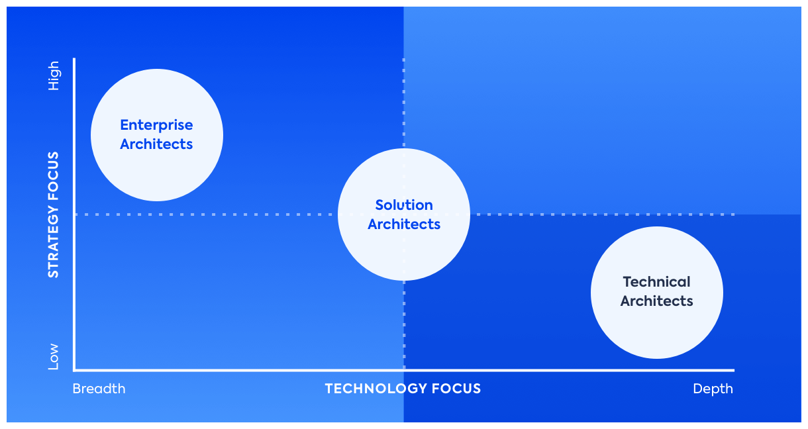

# Enterprise Architect vs. Solution Architect

(original article: https://www.leanix.net/en/blog/enterprise-architect-vs-solution-architect-whats-the-difference)

In this blog post we will discuss the main differences between an Enterprise Architect, a Solution Architect and a Technical Architect.

Let us get started with Technical Architects who provide technical leadership for development teams. These architects usually have a more hands-on approach, defining best practice standards to follow. As this approach has to be focused, we usually only find specialized Technical Architects, such as Java Architect, Infrastructure Architect etc.

**Solution Architects** are also assigned to a concrete project at the firm and thus ensure the technical integrity and the consistency of each solution at a certain stage of their lifecycle. Solution Architects usually spend most of their time coordinating ongoing activities, engaging with all aspects and activities of the initiative, from concept definition, to analysis and implementation of requirements, ending with the transfer to IT operations. A Solution Architect must have a very broad knowledge to be able to contribute correctly to all of these activities. 

Of course, one cannot have a Solution Architect for each and every project, usually a Technical Architect gets assigned to those projects limited to a single implementation, while the risks associated with technology are perceived as significant, a Solution Architect is usually assigned to it.

So how do we know if the risks are high enough to assign a Solution Architect?

Usually some red flags include uncertain requirements of a project, which might constantly change, untested new technologies that we want to implement or projects where multiple new technologies are deployed at the same time.  Another moment where we may need a Solution Architect is when we are outsourcing development to an external team.

So what makes a good Solution Architect? One of the main traits he must have is taking care of the technical solidity and integrity of his solution in a similar way as a Project Manager might look after schedule and budget constraints. 

Last, but not least, Enterprise Architects.

An Enterprise Architect handles the entire enterprise as his name implies. An Enterprise Architect's main interest is describing the company in terms of its business entities, its properties and the relations between them and the external environment. One of the principal concerns of Enterprise Architecture are the lifecycles of the applications and what technologies are used by which one. At the same time, they ensure that the company as a whole have integrity and consistency.

The level of detail an Enterprise Architects goes into is usually limited, delegating the decisions to the specialists assigned to each particular area. 

As a conclusion, I would like to mention that these professions are fast-changed ones.

Often an Enterprise Architect slowly converts into a Solution Architect, or a Technical Architect starts working with a Solution Architect and slowly moves onto that position.

