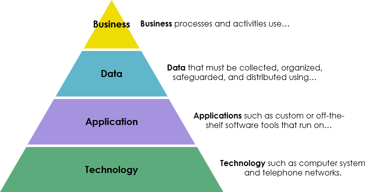
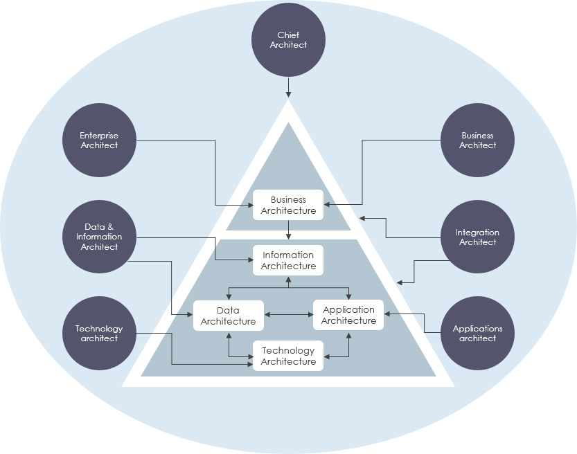
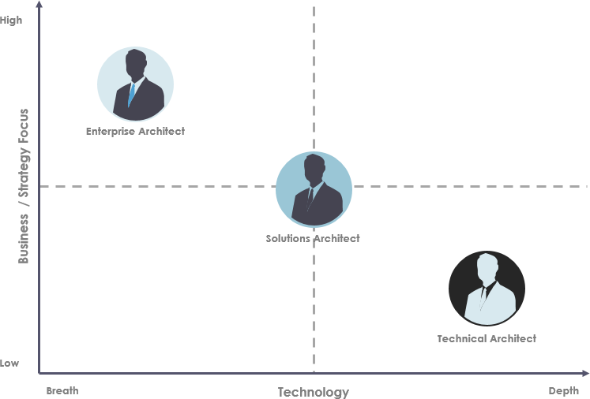

# Enterprise Architects vs Solution Architects vs Domain Architects

(original article: https://www.visual-paradigm.com/guide/enterprise-architecture/enterprise-architects-vs-solution-architects-vs-domain-architects/)

Enterprise architecture is regarded as one of the key ways of achieving competitive advantage through information technology. There is a growing demand to reduce costs, increase flexibility, and regulate technology environments.

Enterprise architecture can be conceptually divided into different architectural layers that involve Business Architecture and IT Architecture (Data, Application and Technology Architecture).

Solution architecture then takes a problem, and proposes building blocks to solve it. It often reuses other elements made available by the Enterprise Architecture (Enterprise Building Blocks, Enterprise Capabilities, Architectural standards and guidelines)

Thus, there are a number of different roles & responsibilities of Enterprise Architects working in the Enterprise Architecture team and elsewhere in the organization. However, people may confuse with these roles and responsibilities, for example, an enterprise architect is sometimes confused with solution architect, or technical architect mix up with the role of infrastructure architect. This is because not only their positions sound similar, the responsibilities partially overlap as well. Yet, each role is essential for the success of a project and could not be substituted by another position. Let’s look at their differences more precisely in this article.

## Four Architecture Domains

Enterprise architecture guides your organization’s business, information, process, and technology decisions to enable it to execute its business strategy and meet customer needs. There are typically four architecture domains and they are often interconnected:

**Business Architecture** describes how the enterprise is organizationally structured and what functional capabilities are necessary to deliver the business vision. Business architecture addresses the questions WHAT and WHO:

- WHAT is the organization’s business vision, strategy, and objectives that guide the creation of business services or capabilities?
- WHO is executing defined business services or capabilities?

**Application architecture** describes the individual applications, their interactions, and their relationships to the core business processes of the organization. Application architecture addresses the question HOW:

- HOW are previously defined as business services or capabilities implemented?

**Data architecture** describes the structure of an organization’s logical and physical data assets and data management resources. Knowledge about your customers from data analytics lets you improve and continuously evolving business processes.

**Technology architecture** describes the software and hardware needed to implement the business, data, and application services.

## Enterprise Architect

An enterprise architect is someone who is responsible for making sure that a company’s business strategy by collaborating with key personnel to define business goals and creates the enterprise infrastructure that supports those goals. The responsibility of an enterprise architect involves assisting with the creation and execution of the information technology architecture roadmap, working with domain architects to design roadmaps for all domains, and determining operational gaps and developing methods for improvement.

The roles and responsibilities of an enterprise architect include:

- Analyzing current trends in the technology architecture field and providing recommendations
- Evaluating applications for compliance with both enterprise and business standards
- Determining the viability of architecture related to organizational changes
- Educating technology personnel on best practices in areas like governance models and frameworks

## Solutions Architect

A solutions architect specializes in evaluating business requirements and turning them into solutions, products, or services. Solutions architects are needed in a variety of industries, including professional services firms or technology consulting agencies. Solution Architects usually spend most of their time coordinating ongoing activities, engaging with all aspects and activities of the initiative, from concept definition to analysis and implementation of requirements, ending with the transfer to IT operations.

The roles and responsibilities of a solutions architect include:

- Managing application development teams during the design and construction phases
- Providing training and mentoring to junior personnel
- Collaborating with application developers on achieving business goals
- Overseeing strategic relationships in a technology environment

## Domain Architects

Domain Architects are specialists with in-depth knowledge within the particular domain of their expertise. They can be part of the Enterprise Architecture Team or working in various Delivery Projects. The word domain is used to relate to the skill sets required for a niche area of knowledge.

- Business Architect
- Application Architect
- Information Architect
- Technical Architect
- Data Architect
- Security Architect

## Enterprise Architects vs Solution Architects vs Domain Architects

- Enterprise Architect defines which problem needs a solution.
- Solutions Architect translates a problem to a solution.
- Domain Architect works within a solution for the domain responsible (i.e. business architect work within the Business architecture together with the enterprise architect, likewise the application architect is responsible application architecture work together with another domain architects)

