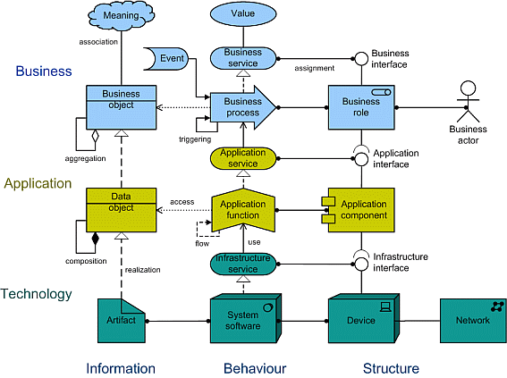
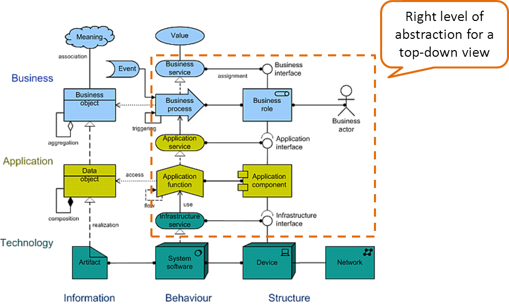
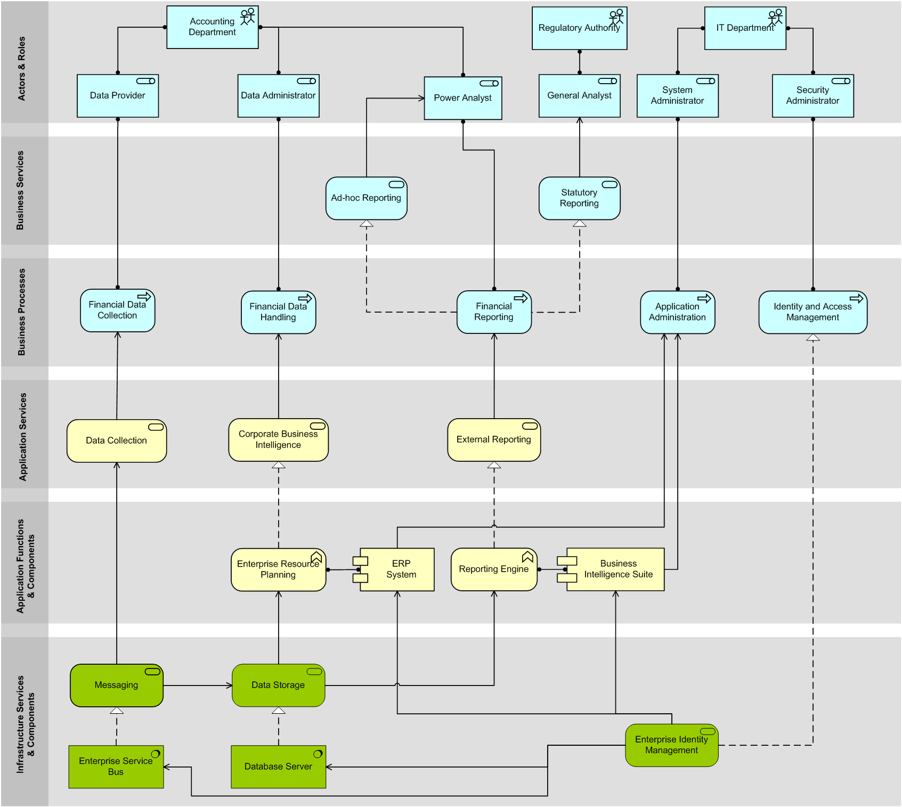

# Bridging the Gap Between Enterprise Architecture and Solution Architecture for Maximum Benefit

(original article: https://www.oracle.com/technical-resources/articles/enterprise-architecture/ricca-bridging-ea-sa.html)

## Introduction

Enterprise Architecture (EA) and Solution Architecture (SA) are often seen as different practices. Of the two, EA is sometimes regarded as the rich and decadent relative while SA is the honest, reliable, and hard-working one.

That perception is not always unfair. It's common to find questions in forums, such as "Can you explain EA's value in one sentence?" or "What is the main obstacle for EA's success?" or even worse. The mere fact that these questions are asked indicates that very often EA is completely misunderstood and ends up as an isolated function with little contact with the organization's real problems and opportunities.

But on the other hand, it's actually not hard to understand where EA can provide value-a lot of value. Principles of reuse, standardization, awareness of innovation, alignment between IT and business, and so on can all obviously help any organization reduce maverick and superfluous costs and instead use its costly IT department to achieve efficiency gains and boost business. The problem is not the "why" or the "what" but the "how." And "how" is exactly where SA excels.

In other words, for the architect to have a real view of the IT landscape and the future needs of the business areas, he needs to be involved in the IT projects. Only then will he be able to justify his recommendations in practice and not just in theory. Money is not abstract, so using it cannot be based on abstract constructions.

So obviously, EA and SA have to work together to effectively build an architectural landscape and reap its benefits to the maximum extent with minimum waste. In fact, EA and SA (which includes network, software, security architecture, and so on) are facets of the same business function: architecture. It's all about optimizing the use of resources to fulfil business needs in accordance with the priorities of the organization. There are many challenges to building an optimal landscape, which is undoubtedly based on a Service Oriented Architecture (SOA).

The steps in the following sections describe one method and some tools that can be used for IT projects and change management procedures. It is easier to steer change when it's going to happen anyway.

## Modelling the Business Architecture with the Business Users and Business Analysts

The first step in creating an architecture concept for a system is to model the business. Generally speaking, in any organization, people play roles, through which they execute business processes that provide business services to someone. Application services are provided to support those processes and are materialized in application components and functions. These use infrastructure services and physical nodes, such as networks, servers, storage, and so on. This provides a layered model of the business, containing most of the information that is required by the architect to start designing the system. The ArchiMate® meta-model captures this concept quite well:

Modelling the business allows the architect to get involvement from the business areas directly, and it's a very good exercise to do at the beginning of any new project, as soon as the user requirements (or use cases or user stories, depending on the methodology) are available. As anyone that has been involved in IT projects long enough knows, and as any statistics on project failures show, most of the problems in projects are created long before the implementation starts. Lack of clarity and completeness in the requirements, poor understanding of the business processes, and changing requirements (which usually occurs due to one of the previous reasons) are the most common and the most expensive sources of problems. Agile methodologies help in dealing with them, but it's still difficult to find a common language between IT and business.

What's missing is the big picture. If the architect can produce a model and show it to the business users, they will immediately recognize if the business roles, services, and processes are represented accurately. This generates discussion that allows the architect to understand the business processes. On the other hand, the business users will also be able to understand how the architect is shaping the systems that they will use.

ArchiMate, now adopted by The Open Group, is very good at bringing people together because it makes it so easy to build and understand a model. A one- or two-page high-level model can show a top-down view of the actors, roles, and business services and functions, as well as how they are expected to be supported by new and already existing application and infrastructure services, and how they interface with other application services. An example is provided in the section Evaluating Different Options with Architecture Analyses.

## Specifying Design Patterns for Each Shared Service

A key area where architecture has a big responsibility is, of course, in optimizing the use of enterprise resources. Resources are, or at least should be, offered via services that have contracts defining the attached service level agreement (SLA).

The consumption of those services should follow guidelines laid out by the architecture function. Otherwise, the architect will quickly lose track of what actually gets implemented, and the biggest value that he can bring-promoting reuse, optimizing resources, reducing costs, and enabling business change-will be "lost in translation."

Building an SOA is really the greatest challenge of architecture, in general. Even though it has been acknowledged over and over that it is the model that provides the most efficiency gains, the fact is that its implementation is still disruptive in most organizations because it defies the conventional vertical hierarchies. Ironically, more often than not, the main obstacle for building an optimized architecture in an organization is the organization itself.

Deploying an Enterprise Service Bus (ESB) is one of the key elements for keeping the system landscape under control, but it's not enough. Most ESBs in the market can provide all the services that are required from an SOA backplane, as described in the Gartner paper "Reference Architecture for SOA Application Infrastructure": orchestration, activity monitoring, community management, communication adapters, message transformation, mediation, and data integration, all provided through a secure, centrally managed, highly available platform. But having all these tools doesn't guarantee that they are used rationally. Interfaces and message flows at the ESB should be designed according to pre-established integration patterns to ensure that they can actually be reused and don't overlap.

There are many sources for patterns for all sorts of technologies. To make an effective use of them, a good exercise is to look at what is currently required at the organization and reverse-engineer the existing interfaces into well-known patterns. This should yield a list that can later be extended as needed. That list should become a reference for all new interfaces and, whenever possible, be used to redesign existing interfaces.

## Evaluating Different Options with Architecture Analyses

Once the business is correctly modelled and full convergence between the expectations of the business users and the perception of the architect has been achieved, it's time to model the application architecture.

The architect should take as input the user requirements, the business model made, the services that should be reused, the policies that are relevant, the patterns that should be applied, and the security and operational requirements. With these inputs, he should produce one or more feasible solution architectures and recommend a way forward.

The proposed architecture or architectures can also be modelled with ArchiMate. The application model is plugged into the business model as its lower layers, with the application services being "used by" the identified business processes.

From my personal experience, the final top-down model should contain at least the top behaviour and structure elements in different layers. The whole purpose of a view (as defined in ISO/IEC 42010:2007) is to provide the correct information at the right level of abstraction to a specific audience. A top-down view allows business users and architects (and mostly anyone) to understand the big picture. It shows little detail about how the business works and how the application components are implemented, but it clearly shows the purpose and the main building blocks of the system.

To illustrate this better, the following diagram shows a hypothetical, over-simplified view of a financial reporting system. The information contained in it is not intended to be complete, concrete, or even accurate and was included merely for illustration purposes.

As can be immediately seen, many elements are missing from this picture. Some were left out or made ambiguous on purpose, but the main point is that it is simple enough so that it can be understood by non-IT persons, and yet it shows clearly which elements can be reused and which need to be created. It also makes it easy to pinpoint where new elements should be deployed as either standalone or shared services and plugged into the ESB.

Other views can and most definitely should be created for different audiences showing, for example, the detailed business model, information flows, physical nodes, system interfaces, application components, and so on. It's both impossible and undesirable to put everything in one view.

Once the high-level models are produced, a structured analysis exercise can be carried out to compare competing solutions and identify the risks, opportunities, and costs stemming from any required architectural decisions. Even if there's only one envisioned solution, it's still a good exercise to do it because it helps detect any architectural issues upfront.

A good way to do that is by using the Software Engineering Institute's Architecture Tradeoff Analysis Method (ATAM). In a nutshell, the method concentrates on testing the architecture against user scenarios. These are use cases, expected growth scenarios, and some exploratory (not expected) scenarios, which are meant to stress test the system.

By analyzing how each component of the system behaves against the target quality attribute values in each scenario, this exercise pinpoints what components are sensitive to which attributes. Examples of attributes are performance, security, scalability, and cost. Components (or aspects) that are sensitive to more than one attribute are identified as tradeoff points, that is, their configuration will influence the whole architecture to favour one or another requirement. Hence, these are the points where a decision needs to be made, and each possible decision carries with it risks and opportunities.

If the architect has identified more than one feasible solution design, then this exercise needs to be done independently for each option so the results can be compared at the end.

It is very useful to complement the exercise with cost information. Because there is always an implicit requirement, which is to minimize cost, it is very important to document the cost implications of each possible decision in the final document. Cost should always be presented as Total Cost of Ownership (TCO) for a fixed time frame (for example, 5 years) and then broken down into what is more meaningful to the organization. Usually, at least investment, operation, and directly allocated costs (for example, licenses) should be shown.

## Presenting the Architecture and Its Benefits to Decision-Makers: "Show Me the Money"

All the results of the previous exercise should be written in a report in which the main findings are summarized. This report should not include the technical details that led to the conclusions, but rather only link back to the full analysis document. Instead, it should include a high-level description of the identified options, the risks and opportunities identified, and the detailed cost information. This way, the system owner, the Director of IT, and any other stakeholders can make an informed decision regarding the way forward. The architect has a valuable chance to clearly show the impact of each decision on the whole enterprise and, thus, influence the new system architecture to make sure it fits the target Enterprise Architecture.

In summary, the report consists of a concise statement of the proposed architecture and decisions that need to be made with their inherent risks, opportunities, and costs. This is the most important document that the architect will produce, so nothing should be left out, unclear, or assumed. Usually, the architect will need the help of subject-matter experts, including business analysts and IT experts, to produce this document.

The document should state only facts and explain what specific quality attributes are affected by each decision and how they are affected. It's up to the stakeholders to find the right balance between, for example, system performance, security, or cost.

## Assessing the Implementation and Identifying Compliance Gaps

Once the detailed solution design is done, or even during implementation time, it might be that the system architecture that was initially documented can't be completely realized. This might be because of changing requirements, unforeseen constraints (for example, less budget, less time, or fewer resources), or simply because something was overlooked or wrongly assumed.

Any deviation to the plan can have consequences on the whole enterprise. Based on the analysis document produced before, it should be straightforward to understand what the impact is and where it occurs. Some additional analysis might be required, but that is unlikely.

Regardless, the system should not get implemented in a different way than originally planned without formal acceptance. For that purpose, the architect should communicate the expected gaps to the stakeholders as soon as possible.

It is also a good practice to perform a gap analysis at the end of the implementation of a project. The mere existence of a final analysis is mostly useful as a deterrent to prevent project teams from taking "shortcuts" when the project is slipping in time and/or budget.

If a project team knows in advance that taking a shortcut from the agreed-on architecture design will create a risk that the system will not be accepted at the end-which is, by definition, a project failure-the team most likely will not deviate from the design.

## Describing the Gaps in Terms of Business Impact

In order to write an expected gaps report an architect needs to do the following:

- Translate the gaps in terms of real business impact.
- Understand the root cause of each gap and explain the cause in non-technical language.
- Propose mitigating measures, together with their cost and impact.
- Identify and inform the affected stakeholders. Ultimately, each stakeholder needs to either accept or reject the changes. This process allows the architect to prevent deviations that might compromise the SOA.

Typically, a gap report generates discussions between the project steering level and the management function, and a final decision can take a long time, at least from the project team's perspective. Therefore, at this stage, it is expected that the project team and the architect work in much closer collaboration.

## Summary

Involving EA in the development of projects and in change management is the best way of driving the development of an SOA. Clearly communicating the impact of each decision to the organization quickly makes it obvious that sharing services, investing in reusable components, and always reusing before deploying-in short managing the IT landscape consistently across business unit boundaries-provides the most benefits.

Soon it will come to the point where many new application services can be created simply by configuring existing components, that is, as pure composite applications. Then the cost savings really start taking off. Just compare the TCO of a new application installed on one or more servers versus the cost of reusing existing services. The managed agility of the organization will also increase dramatically and, more importantly, in a fully managed and secure way.

The main difficulties to achieving this approach are organizational. Because each stakeholder favours his requirements and often these are in contradiction with others' requirements, the architect needs above all to be transparent, objective, and impartial. The biggest driving force for a project is delivery on time and within budget, so additional investments for a "common good" need to be well justified and planned upfront.
