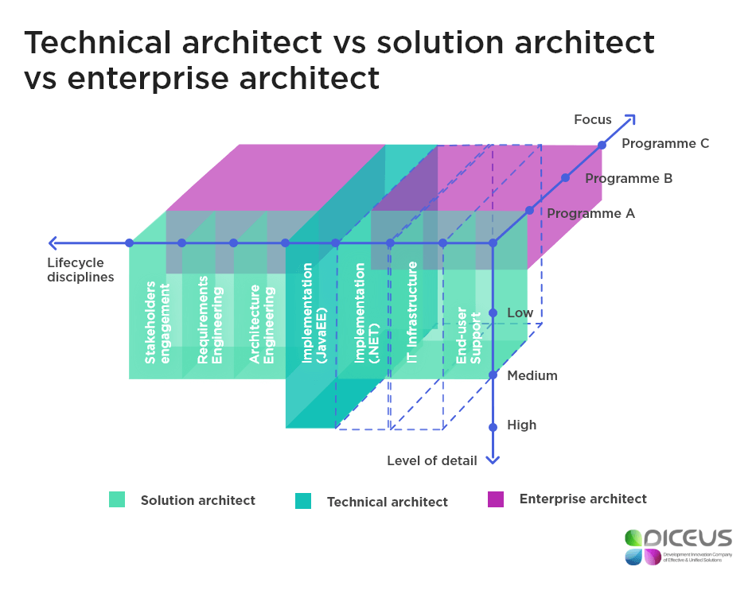
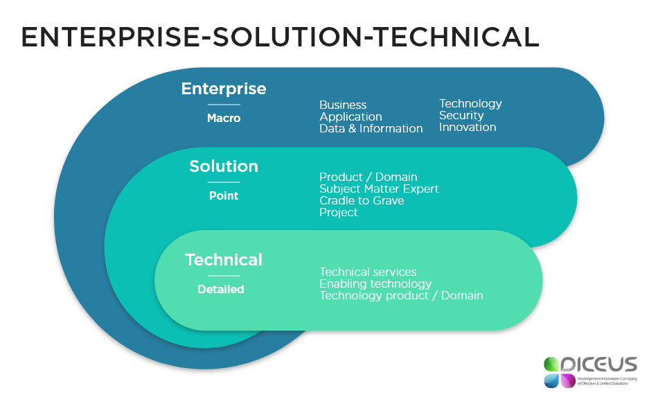

# Technical Architect vs Solution Architect vs Enterprise Architect

(original article: https://diceus.com/technical-architect-vs-solution-architect-vs-enterprise-architect/)

Technical, solution, or enterprise? We are talking about architects. These roles are fast-changing thus very often – interchangeable.  

Technical architects use hands-on approaches in architecture development to provide technical leadership within the project lifecycle. Usually, they are named in accordance with the technology they are qualified in, for example, a Python architect.

Solution architects are focused on managing ongoing project tasks and activities, analyzing the consistency of the solution, requirements implementation, and other operations within the project. Often, solution architects get assigned to technology risks while technical architects are responsible for implementation. The risks assigned to solution architects may include unclear requirements, untested innovative stacks, etc. The roles taken by solution architecture specialists are much similar to those taken by project managers.   

Enterprise architects are engaged in enterprise activities like analyzing business properties, entities, external environment, etc. They deal with such questions as apps lifecycle, technology, company’s consistency, and integrity. The scope of work enterprise architects do is limited thus they often delegate tasks to other people assigned to a particular area.  

To understand the differences among these three architecture roles I have conducted my own research using the sources available over the Internet which provide the most comprehensive information on this topic.

A solution architect presented a diagram illustrating the framework contrasting technical architect vs solution architect vs enterprise architect. In his diagram, Mr. Pandu uses 3 dimensions that determine the roles of architects: life cycle disciplines, levels of detail, and focus. The first dimension includes a set of activities performed on a particular stage of SDLC (stakeholders involvement, software requirements, and specification engineering, architecture design, implementation, maintenance, etc.). The second dimension combines different information needed to perform the responsibilities of the role. The third dimension is all about different workstreams within the company.

According to this framework, technical architects are aimed at realizing particular technical implementation processes. However, they can be also involved in the entire solution life cycle. They are responsible for the project delivery and leadership for developers in terms of technology. As I mentioned earlier technical architects are usually occupied with one technology and are named accordingly.

Solution architects ensure product consistency. They are responsible for the activities related to the requirements capture, concept design, implementation, maintenance.

Enterprise architects deal with the enterprise-level design of the IT landscape in the context of the business capabilities of the organization. They must understand the conceptual enterprise and be able to bridge the gap between context and concept.

Since we understand clearly how a technical architect differs from solution and enterprise architecture specialists, let’s compare a solution architect with an enterprise architect.

| Solution architect | Enterprise architect |
| :----------------- | :------------------- |
| focuses on a fewer number of products or projects | tends to operate across multiple products and projects |
| focuses on tactics | tends to be strategic |
| responsible for building and leading the design of specific products | present at larger organizations where there is a diverse and large portfolio of systems or  |applications
| facilitates important design decisions | reports to executive levels to provide the highest level oversight, the goal is to mitigate the risks |
| negotiates on behalf of the functional domain and helps guide the design of initiatives in different sub-systems or applications to support the objectives | tends to  |drive standardization of methodologies, design approaches, tooling, and technologies across the organization

## We Compared Software Architect vs Solution Architect

We have figured out how solution, enterprise, and technology architecture specialists differ. There is one more issue about software engineering roles. Most people don’t see the difference between a solution architect and a software architect as well as lots don’t understand the difference between software architecture and software engineering.

Software architects handle system organization as a collection of interacting components. A well-designed architecture can help ensure that a system will satisfy its key requirements, particularly with respect to system-wide properties such as performance, reliability, portability, scalability, and interoperability. A badly-designed architecture can be disastrous. Software architecture is an important subfield of software engineering. It is critical for successful system design and development.

The architecture of a system defines its gross structure. This structure illuminates the top-level design decisions including things such as how the system is composed of interacting parts, where are the main pathways of interaction, what are the key properties of the parts.

## Do You Confuse the Meanings: Enterprise Architect vs Software Engineer?

Another confusion that can arise is the difference between an enterprise architect and a software engineer. We have defined the roles of an architect so they should be distinguished from those performed by an engineer. Below are the most frequent roles and responsibilities of software engineers:

1. Design, code, unit test, and debug.
1. Collaborate with testing teams to debug errors.
1. Code regression testing.
1. Participate in machine setups through code load, logical configuration, and upgrades.
1. Utilize and develop technologies.
1. Document and demonstrate solutions.
1. Improve operations.
1. Obtain and license software.
1. Specification and modeling.
1. Implementation.

As you can see, software engineers are doing much of a technical job whereas enterprise architects are busy with business processes and design mostly.

## How Much IT Professionals Earn: Architect vs Developer Salary in the USA

To better understand the difference between architects and developers let’s compare their rates/salaries in the United States.

According to Glassdoor, technical architects earn $89,500 per year on average. Enterprise architects make $126,000 per year whereas solution architecture specialists earn $116,000 yearly. I found that the average software engineer salary is very similar to that of the solution architects – $104,000 per year. The lowest yearly rate of software engineers in the USA is $69,000 and the highest one is $154,000. However, there are higher payments. For example, Google offers the distribution of salaries from $80,000 to $223,000 per year.

## What Is Enterprise Solution Architecture?

Enterprise solution architecture should not be confused with other types of solution architecture. It is all about enterprise-grade solutions like ERP, CRM, or other. The main objectives of enterprise solutions are to boost sales, manage the business more effectively, boost marketing, boost productivity, enhance customer relationships. They include different types of applications such as follows:

- ERP
- CRM
- SaaS
- Business Intelligence
- Enterprise Mobility
- Enterprise System Integration
- Project Management
- Supply Chain Management
- Other

Here is an example of enterprise solution architect roles and responsibilities determined in a job description provided by Griffith University:

1. Consult with executive management and operational staff from assigned client areas on business needs, information and technical system requirements and opportunities.
1. Assist program and subsequent project staff in the development and implementation of architecture deliverables that result in enhanced business/IT alignment and drive adoption and value from the University’s enterprise architecture initiatives.
1. Prepare, as required, planning documents, proposals, and reports for the various University Committees and Advisory Groups.
1. Investigate new technologies, tools, and methods of relevance to information and technical systems; identify opportunities to use new technology to solve problems and enhance services.
1. As a senior member of a program team assists the Program Manager in required aspects of program delivery.
1. Guides dedicated Solution Architects within subsequent project(s) to ensure consistency with the Program architecture(s).

The university requires the candidates to have a certain set of skills to obtain this job:

1. Completion of a Bachelor’s degree in Information Technology (or relevant subject area) and a combination of relevant experience, education, and training.
1. Proven record in client relation skills and ability to communicate effectively with a variety of senior business clients in written or verbal form, in particular, the ability to write clear and concise reports.
1. Proven experience working with business and technical staff with competing priorities, in particular, conflict resolution, mediating opposing viewpoints and solution negotiation.
1. Extensive experience in the design, development, implementation, support, and administration of major information and technical systems. Includes, solid software development life cycle (SDLC) experience.
1. Demonstrated analytical and problem-solving skills in business analysis, systems design, technical design and specification and implementation of major information and technical systems.
1. Demonstrated broad knowledge of new technologies, development practices, architecture methodologies, and software quality practices.
1. Demonstrable experience to manage a team undertaking the design, development, implementation, support, and administration of major information and technical systems. Formal training and/or certification in an Enterprise Architecture framework and Project Management methodology.

I think these responsibilities and skills required will help you identify the major things any enterprise solution architect does within his/her work scope.  

## One More Comparison to Take Into Account:  Solution Architecture vs System Architecture

Since we know what solution architects do, let’s find out what system architecture is.

[Kasse Initiatives](technical-architect-vs-solution-architect-vs-enterprise-architect-kasse.pdf) defines as the fundamental and unifying system structure defined in terms of system elements, interfaces, processes, constraints, and behaviors.

A system architect, not only knows about the individual components but also understands the interrelationships among the components and creates sophisticated IT systems.

Other confusing terms are system architecture vs software architecture. Note that software architecture is the global organization of a software system, including:

- division of software into subsystems/components,
- policies according to which these subsystems interact,
- the definition of their interfaces.

To sum it up, the terms under this review are quite confusing as well as their meanings are. That is the reason why so many people, especially those who are new to the IT industry, confuse those and use wrong notions to express what they mean.

If you are a newcomer to IT, better consult any professional dictionary to learn the meaning of the given job name. While you think it’s not so important, you can be put in an awkward position.

