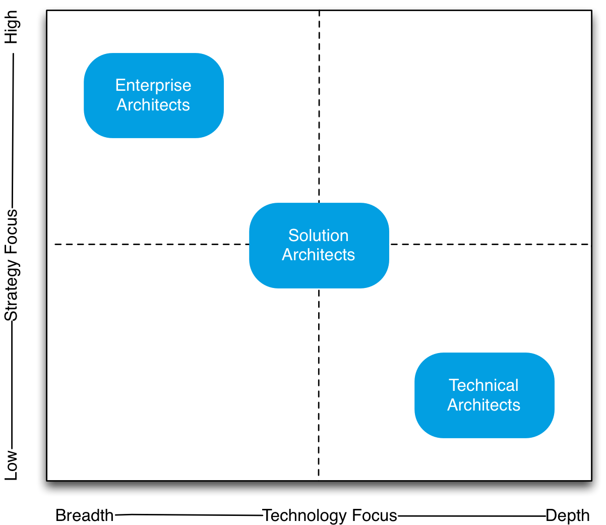
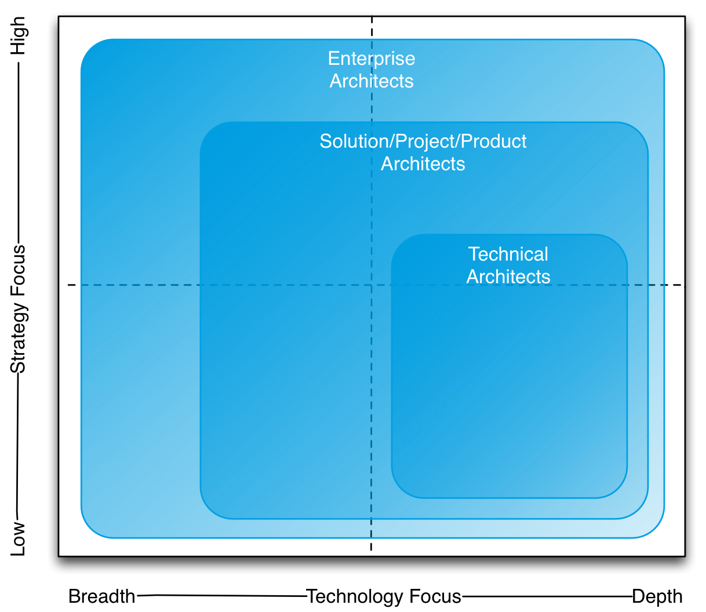
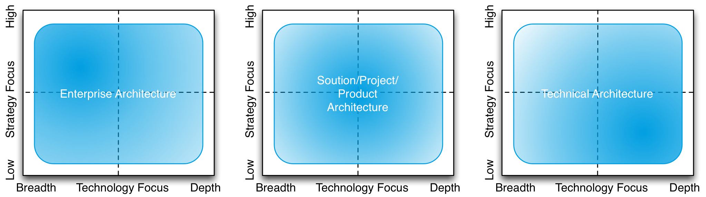
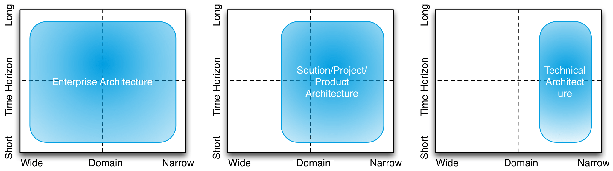

# Technical vs. solution vs. enterprise architecture: a matter of scale

(original article: https://eapj.org/technical-vs-solution-vs-enterprise-architecture-a-matter-of-scale/)

I generally rather talk about real architecture issues than about architects (navel-gazing is something enterprise architects are particularly prone to do and I like to stay away from it as much as I can), but there is something about the roles for architects you recognise that says something about the way you see architecture. There is something that I call “the orthodoxy” (or Good Old-Fashioned Enterprise Architecture—GOFEA; see GOFAI), which says that enterprise architecture is about high level strategic issues, whereas—say—solution architects are more about details and technology. Implicitly, this says “enterprise architecture is about high level and strategy only.”

I’m prompted to write this because I recently came across a blog post announced in different architecture groups on LinkedIn. Incidentally, there are several architecture groups on LinkedIn, and except The Enterprise Architecture Network —which is so unmodified that very off-topic posts end up there— they tend to be run by commercial interests and they tend to consist mainly of posts that are part of the marketing presence of companies in the enterprise architecture field. This even leads to the occasional censorship. Which proves one more time that there is no free lunch. The people maintaining the groups have to get paid, and as there are no paid subscribers, editorial work is paid by those that have something to sell. That is even true for groups that seem to be run by neutral associations (which sometimes are just another interesting form of commercial enterprise, but I digress).

Anyway, that doesn’t mean what is distributed is by definition nonsense, of course. Commercial interests are an important part of innovation and skills. But I thought this blog from leanIX actually presented the orthodox position well. I’ve recreated their picture which is pretty clear:

According to leanIX, “Technical Architects […] provide technical leadership for development teams” and examples are ‘Java Architect’ or ‘Infrastructure Architect’. “Solution Architects […] ensure the technical integrity and the consistency of each solution at a certain stage of their lifecycle [and] must have a very broad knowledge”. Not every project gets a Solution Architect, only when “the risks associated with technology are perceived as significant” or “when we are outsourcing development to an external team”. Finally, “an Enterprise Architect’s main interest is describing the company in terms of its business entities, its properties and the relations between them and the external environment”. Concerns of Enterprise Architecture “are the lifecycles of the applications and what technologies are used by which one” and “[ensuring] that the company as a whole have integrity and consistency. The level of detail an Enterprise Architect goes into is usually limited, delegating the decisions to the specialists assigned to each particular area.” The whole setup is classic, and for me it always seems to stem a bit from the desire of enterprise architects to explain what makes them so special anyway, what makes them different. It is, in that respect, a bit telling that enterprise architecture is often defined by its practitioners as what is it not (not solution architecture, not IT, not technical, etc.), much less what it is.

There are two serious problems with the classic approach: you actually need a strategy focus too when handling deep technology and you do need to pay attention to relevant (technical) details to make a good strategy. These are not aspects you can delegate, it is an integral part of what it is to be an architect. Creating a cloud-strategy, for instance, requires knowledge on low level details such as latency or some arcane rules from the regulators related to data protection, to mention something non-technical. Not taking that ‘deep’ knowledge into account will lead you on paths that will fail in a spectacular way, burning money as you go. As I’ve argued in Chess and the Art of Enterprise Architecture, the high-level no-detail GOFEA enterprise architect is mostly useless in the fight to solve the pressing issues architecture needs to solve. Take attention to details, for example. In chess: the position of a pawn (the detail), may win or lose you a chess game, In architecture: ignoring technical details may make or break a strategy.

If I had to create a picture, it initially would look like this:

The first and most obvious change is that for me, enterprise architecture is not separate from the others, it encompasses them. Enterprise architecture covers all architecture of the enterprise. The problems enterprise architecture needs to solve stem from the enormous complexity of all dependencies, and the unknowability of all (sometimes key) details and of the future. Enterprise architecture is not a field that lets itself be sliced in neat independent parts, because in reality the parts aren’t independent at all. So, technical issues may influence strategy (in fact this may happen even more often than the other way around: cloud computing wasn’t invented because businesses were demanding it) just as strategy influences technical issues.

It is impossible to do a substantial amount of actually effective (and useful) work when you’re just active in the upper-left corner. The upper left corner is important, yes, but it’s not the sole work area (and it has to be approached differently than the orthodoxy preaches, but that is another subject). Enterprise architects must also (and maybe even mostly) engage on the level of solution architecture or even technical architecture. For instance, when they make sure the different technical domains in the enterprise do not contradict each other, something that cannot be handled by just acting in the upper left corner. And when people try to do that by acting in the upper-left corner only, they come up with tools like ‘architecture principles’, which are generally useless and often toxic.

A second change is that I think all architecture has a strong strategic vein, not just enterprise architecture. Even the technical architect needs to think strategically. He or she is not solving a current issue, he is doing it with the intent of making the right strategic contribution. And that is not the same as following the strategy that drips down from higher up. For one: the strategy of a company changes far more often than the core structure of its landscape (don’t let gurus and pundits fool you on this point). So the architecture of this landscape must be robust under such uncertainty, and that requires strategic choices of its own. I’ve seen companies make 180 degree turns on strategy in certain domains (e.g. from B2B to B2C), but they had to do that with the landscape that had not been designed for the new strategy (e.g. B2C), because it was optimised (more or less) for the original strategy (e.g. B2B). Success depended on how robust that landscape was under that uncertainty. Good architects guide the evolution of enterprise landscapes so that these are well prepared for such changes (agile, anyone?). Actually, one of the worst things you can do is design architecture starting from the business strategy, then ‘down’ (waterfall), given that the business strategy of an organisation generally changes a lot faster than the core of its landscape. Interestingly enough, that waterfall approach is just what all the major orthodox frameworks preach.

We might wonder why. Svyatoslav Kotusev from Melbourne University has done a wonderful job at mapping the history of enterprise architecture frameworks and sourced them all back to IBM’s Business Systems Planning of the 1960s. That approach still rules most EA approaches to this day (see Svyatoslav Kotusev, The History of Enterprise Architecture: An Evidence-Based Review, 2016).

The third important change is that in my view you cannot be a good enterprise architect without a broad and (here and there) deep knowledge of technology, and with both attention to strategic issues and day-to-day ones, as both feed on each other. Paper tigers that live in the upper left corner, that can draw pretty pictures in powerpoints with some boxes and arrows, and that can set up a few simple (but rather toxic) rules, aren’t all that effective and useful. There are by far not enough enterprise architects who can pull the real thing off. Often the enterprise architects are those that have lost the touch with what they are architecting and their move to high strategy and low technology is more a flight than a fight.

In my view, a real enterprise architect will for instance study blockhain to a depth that he can get a feel for strength (and weaknesses!) and that includes actually understanding the technology at a deep enough level. Enterprise architecture is more than shouting “Blockchain! Yeah!”, “Big Data! Go!”, “Cloud! Yippy!”. Billions of euros, dollars, yens, pounds, franks, and so forth are lost to failed and ineffective transformations each year because of such approaches to architecture (by architects and non-architects alike, I might add).

Looking at it this way, you see—apart from the fact that enterprise architects also need to have insight in organisational and psychological issues—how hard it is to be a good enterprise architect and why you have to pay the (rare) good enterprise architects those big bucks… 🙂

Now, it is of course impossible for a single person to know everything about everything and it is even not always necessary. That is why it is important to pay attention to the relevant details and the skill of the enterprise architect in part depends on this skill and on organising architecture governance in such a way that the organisation as a whole is able to bring (collectively) the right knowledge to bear. This remains true even in the age of agile. Secondly, the success of enterprise architecture doesn’t come from definitions (e.g. “what is a business function”) and following waterfall methods (“first define the business strategy and the ‘as is’ landscape, then define the ‘to be’ landscape, then define a transformation program, etc.”) like those in the major orthodox enterprise architecture frameworks based on the ‘planning’ paradigm. For me, success in real enterprise architecture comes from governing the continuous ongoing change in the organisation (strategy-driven or otherwise) in a way that all that ‘evolutionary’ turmoil doesn’t end in extinction (of the firm). Try to imagine what happens without architecture in whatever form, and you’ll see. Enterprise architecture is only a little bit planning, mostly it is guiding. And measuring the success is not about enterprise artefacts, it is about the level of technological debt and architectural features in your actual business–IT landscape.

Actually, the picture above doesn’t convey the message well enough. In fact, I think that any architect has in some way a relation with the entire architecture/enterprise. So, I would probably sketch it like this:

While technical architecture is focused on ‘deeper’ (a relative term, by the way) technical issues, it still has to be involved with broader and more strategic issues. A well set-up architecture governance will make sure that the enterprise architects don’t just play around in the upper left corner and the technical architects in the lower right, but it will make sure that each engages with the other about either’s focus. The right governance (based not on planning but on checks & balances, see this video at 44:37 in) is the key to success.

Finally, even this last picture doesn’t satisfy me entirely. In the end, there may not be a difference between enterprise architecture, solution architecture and technical architecture but the ‘size’ of the subject. Enterprise architecture is just solution architecture, but at a larger scale: ‘the enterprise’. All these kinds of architectures are just a matter of scale. As the scale increases, the details become harder to manage because there are more of them. And it’s more than just ‘design for the issue at hand’. Most importantly, architecture — while only useful when it’s about the real world — is always somewhat strategic. That’s one way how we might define (technical, solution, and enterprise) architecture: design for the long term.

By the way, defined like that, it becomes natural to link the strategic side of architecture to ‘the art of the long view’ as Peter Schwartz called scenario planning in his book of the same title. Note: the scenarios (‘plots’) are not helpful/needed in enterprise architecture (same video as mentioned above, a bit further in). The uncertainties alone will do the job. Actually, uncertainty planning would have been a better name for the methodology; the actual scenarios (‘plots’) are not the most important part of scenario planning, just a way to make it more manageable. But I digress (as usual).
