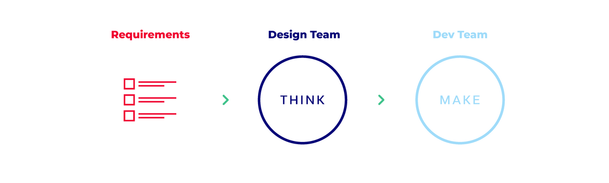
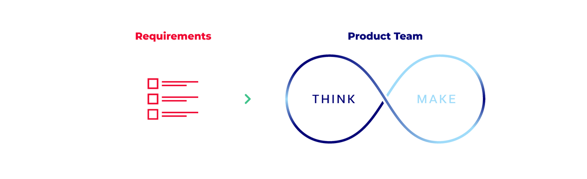

# Design-driven development

(original article: https://uxma.com/en/services/designdriven-development.html)

This is the truth: the perfect process does not exist. The application of a specific process model does not automatically guarantee the best product solution. The decisive factor for the success of a project and the time to market is rather the combination of the right framework, the right tooling and the right people.

As a development partner and service provider in various industries and projects, we have gained a lot of experience over the last three decades. Becoming agile was a process. For us, staying agile means constantly checking whether the respective process model fits the product. In addition to the variables that can be changed, there are also constants in everyday project work that can - and should - be trusted.

## The old picture of the process

In many projects a classic picture can often still be seen: the customer (often represented by his middle management stakeholders) has a list of requirements that he passes on to the design department. After the analysis phase, concepts are developed and evaluated together with the customer before they are developed. The finished design is then handed over to the development department, which is then busy implementing what has been specified to the best of its knowledge and belief. Finally, regardless of whether it is the final result or a stage of the process, the result is handed over to the stakeholder.

Both the design and the development process have changed in recent years. Design has taken a more holistic view of things and user experience and usability have become an established "must" - not to mention the "brand" theme in the product. New tools also make design development faster and more efficient.

At the same time, a lot has happened in terms of agility in software development. Anyone who develops today without an agile mindset and without Scrum or Kanban and does not think in terms of small increments, clean components, scalable architectures and constant change, especially in large software projects, will find it difficult to keep up with the competition.

But in the separate sequence of requirements, design and development, something like a waterfall model can also be seen - a risk for the success of the project, especially if in principle it is only a matter of completing the delivery item.

## The drive to do the right thing

Being driven and motivated to do the right thing also depends, to a certain extent, on the inner attitude. In design-driven development, the primary goal is to learn from the requirements more quickly and to be able to provide clear-cut definitions of these requirements - not detached from each other, but as a product team. The focus should be on discourse. Design can help to support this discourse and further development through visuals and to gain knowledge more quickly. True to the motto "learn fast", this is where the real potential lies: the best products are the result of continuous simplification and detailing as well as an individual approach.

Unnecessary repetition can be omitted if the development goal is understood by all project participants at an early stage and the jointly developed specification is available. The close and interdisciplinary cooperation of designers and developers in a product team is successful when Scrum and Kanban are redesigned. Rapid testing and the fulfilment of product requirements by the entire team enable solutions that built on a sound foundation, raise fewer questions in development and are, above all, visible more quickly than in a two- or three-week cycle.

Advantages of design-driven development:

- Faster specification and visualization of requirements
- Mutual product understanding
- Early elimination of misunderstandings
- Faster gain of knowledge through early testing and joint evaluation
- Lower risk by dissolving independent phases (Requirements & Design & Development)
- Reduced development effort / fewer repetitions

If all experts contribute and participate in the success of the product, this not only promotes the team spirit, but can also bring some "start-up" culture into the project. This not only suits us, but is our UXMA performance promise as a development partner: Comprehensive product development with individual product teams.
