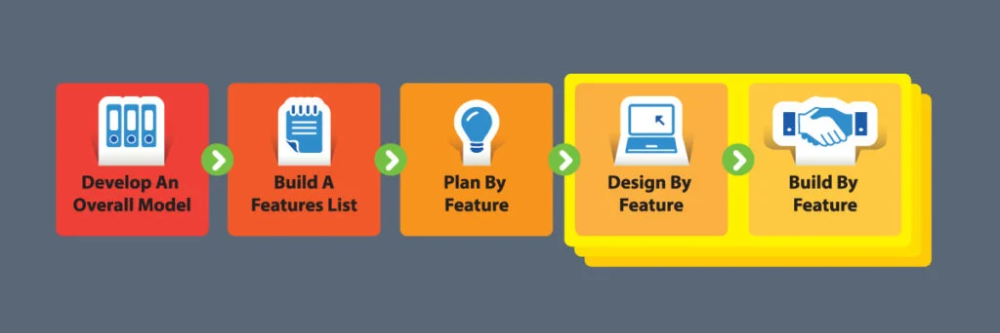
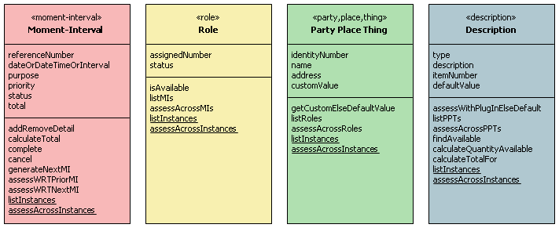
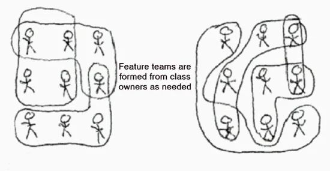

# 9 Things You Must Know About FDD – Feature Driven Development

(original article: https://www.openxcell.com/blog/9-things-must-know-fdd-feature-driven-development/)

FDD, the Feature Driven Development methodology is aligned with the Agile development methodology. It is a design-oriented agile process developed and refined by Jeff De Luca, Peter Coad, and others. The project is divided into features. These features are small pieces of a complete project. With the help of FDD, you can create design, code, and code inspection schedules without going into elaborate paperwork. Here the focus is more on relying on people and their roles for development.

## 1. FDD has 5 Process Steps 

### Develop An Overall Model:

The client and the development team make an overall model. Detailed domain models are created and then these models are progressively merged into the overall model. Guided by a chief architect, team members get a good understanding of the complete model.

### Build a Features List
Information gathered in the 1st step is now deduced to make a list of required features. A feature is a small, client valued output. The whole project is thus divided into features. A feature needs to be delivered every two weeks. Therefore the feature the team decides to work on must take less than two weeks to be implemented.

### Plan By Feature

Now the development of features is planned. It is all about in which order the features will be implemented. Teams are selected and assigned feature sets.

### Design By Feature

The chief programmer chooses the features and the domain classes that will be involved in designing the feature. Sequence diagrams are drawn. General designs of the features are also finalized. Class and method prologues are written. It is all followed by a design inspection.

### Build By Feature

After the design inspection, the domain expert explains the specifics, class owners start building and implementing all the items necessary to support the design. Code is developed, unit tested and inspected and approved by Chief Programmer who then gives an ok and the completed feature is added to the main build.

## 2. FDD Is A Practical Short-iteration Process

Feature Driven Development is a model-driven, short iteration process. Before the process begins the overall model shape is established. The development of features is then on track with a series of two-week “design by feature, build by feature” iterations. Most importantly the features are small “useful in the eyes of the client” results. Developers focus on the features that are important to the client.

## 3. FDD is Agile

FDD is an agile methodology. Businesses these days don’t want to wait a long time for results. The crux of this methodology depends on the iteration cycle of two weeks. The features are built within 1-12 days. Any feature that requires longer build time than this is further broken down till it meets the two weeks rule.

## 4. FDD Uses The Best Of Methodologies

FDD incorporates the best of different agile methodologies like Extreme Programming and Scrum. It uses model-centric techniques including Domain-Driven Design by Eric Evan and modeling in color by Peter Coad.

Domain-Driven Design focuses on the core domain and domain logic. Complex designs are based on the model of the domain. One needs to constantly collaborate with the domain expert to improve the application model and resolve domain-related issues.

There are UML color standards – a set of four colors associated with Unified Modelling Language (UML) diagrams. The colors indicate the archetypes applied to the UML object.  UML reporting component captures feature progress during FDD. The use of color enables a quick understanding of the problem domain’s dynamics.

Four class archetypes – each with typical attributes and operations.

## 5. Class Ownership Is Important in FDD

Every class of the developing feature belongs to a specific developer. Class owners are responsible for all changes that are made during the implementation of the features. Class ownership by developers immensely improves the quality of the codes. Class owners thus are the experts. XP has the concept of collective ownership, where any developer can update any artifact, including source code if required. FDD instead has specific developers in charge of the classes so if a feature requires changes to several classes then the owners of all those classes come together, make changes individually and as a part of the feature team to implement the feature.

## 6. Feature Teams

In a feature team in FDD, everyone has a specifically defined role. FDD thrives on different viewpoints. It ensures that multiple minds are used when taking each design decision. This opens up several options to explore. A feature team typically has a project manager, chief architect, development manager, domain expert, class owner, and chief programmer. For each feature, an ad hoc feature team can be chosen with the team members who suit the roles best. It can be a cross-functional and cross-component team. The feature team’s focus is on developing and implementing all the features listed in the project one by one.

## 7. FDD Enables Tangible Results

In FDD, features are planned and developed one by one as incremental units. Developers can see the results and implementation in a short time – in fact, every two weeks. It helps in quality control and enables the developers to get a better grip on the complete process.

## 8. FDD Can Be Scaled To Large Projects

The scalability of FDD to large projects is a key advantage. It can scale easily as it has enough processes that can go simultaneously domain wise and ensure quality development. There are short design and implementation cycles. Stakeholders can see the results every two weeks. There are proper reporting and tracking of progress which ensures roles of the teams are clearly defined.  The modeling stage in FDD is JEDI- Just Enough Design Initially. It enables the processes to move forward to the next step quickly. It uses domain-driven design techniques. It is very easy to work with large teams using FDD. New members can easily join the processes. The best methodology for complex projects.

## 9. FDD – An Inclusive Methodology

It is a simple but comprehensive methodology. It is very easy for organizations to adopt. All the stakeholders get involved from the beginning of the project right from the time the feature list is made. There is no scope of any unpleasant surprises for anyone. All the way through the software development lifecycle through FDD there are reporting mechanisms that keep everyone in the loop. Iterative designs involve everyone. Everyone works towards the same set of goals.

