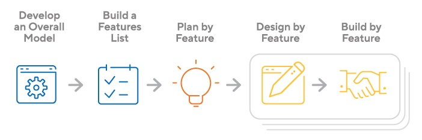

# Feature Driven Development (FDD)

(origicnal article: https://www.productplan.com/glossary/feature-driven-development/)

## What is Feature Driven Development? (FDD)

Feature Driven Development (FDD) is an agile framework that, as its name suggests, organizes software development around making progress on features. Features in the FDD context, though, are not necessarily product features in the commonly understood sense. They are, rather, more akin to user stories in Scrum. In other words, “complete the login process” might be considered a feature in the Feature Driven Development (FDD) methodology.

## What’s the History of Feature Driven Development?

The first real-world application of the Feature Driven Development methodology was on a 50-person software-development project for a Singapore-based financial institution, and the first public discussion of the methodology was in the 1999 book Java Modeling in Color with UML.

FDD was designed to follow a five-step development process, built largely around discrete “feature” projects. That project lifecycle looks like this:

- Develop an overall model
- Build a features list
- Plan by feature
- Design by feature
- Build by feature

The framework has since gained widespread use particularly in larger organizations, and today there is a thriving Feature Driven Development community with its own website.

## Strengths and Weakness of Feature Driven Development

### FDD’s strengths include:

- Simple five-step process allows for more rapid development
- Allows larger teams to move products forward with continuous success
- Leverages pre-defined development standards, so teams are able to move quickly

### FDD’s weaknesses include:

- Does not work efficiently for smaller projects
- Less written documentation, which can lead to confusion
- Highly dependent on lead developers or programmers

## Should You Use Feature Driven Development?

If you’re with a big corporation or are working on a large-scale software project, FDD might be right for your project. But this methodology relies heavily on chief developers and has a top-down decision-making approach, as opposed to some of the other agile frameworks (such as XP) that are based more on collective project ownership. If that type of methodology fits your company’s culture, then Feature Driven Development is worth investigating.
