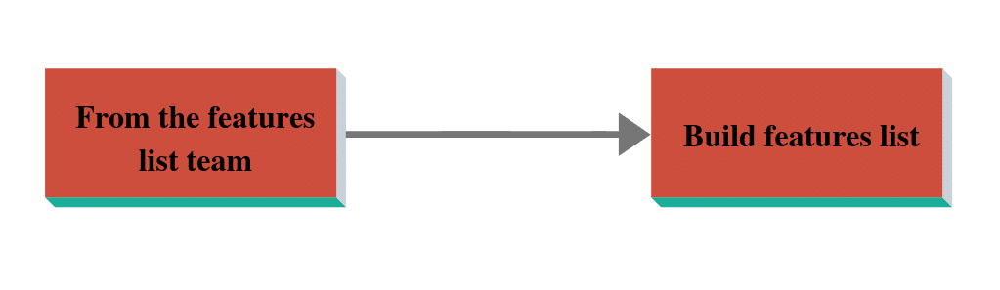

# Feature Driven Development (FDD): An Agile Methodology

(original article: https://www.toolsqa.com/agile/feature-driven-development/)

**Feature Driven Development (FDD)** - As the name says, the feature would be the most crucial aspect of this process. The practices this method follows might not be new. However, their blend is. In addition to the above, this method finds a solution to significant and challenging problems.

- **What is Feature Driven Development** (FDD): We will talk about the main aspects of FDD. We will talk about what it focuses on and what are the main features.
- **History of Feature Driven Development** (FDD): We will get to know the history behind FDD. How its development happened and the reason behind skipping other methods.
- **FDD practices**: Explanation of all eight practices along with supporting examples and diagrams.
- **Roles and Responsibilities**: Introduction of all positions in all three categories; will discuss the leading roles in detail.
- **Feature Driven Development Process**: Explanation of all five processes included with the help of diagrams, flow charts, and in a proper template.
- **Scrum and FDD**: Discussion on the differences between the two methods takes place here. These two methods have similar properties. Therefore, it is crucial to know how it is different from Scrum.
- **Advantages and disadvantages of Feature Driven Development Model**: FDD has many benefits, but like any other methodology, it's got drawbacks too. Therefore, we cannot blindly apply it in every project development.

## What is Feature Driven Development (FDD)?

**Feature Driven Development** (FDD) is an Agile framework that focuses on features. It's a framework which

- Is short and iterative
- Emphasizes on Quality
- In addition to the above, it is Design compatible with large projects
- Delivers frequent features in all the iterations
- Moreover, it provides accurate progress information
- Is famous among client, developers, and managers

The Values of a framework are the values that make that framework different from others. There are a few values that are important and affect all the aspects.

- Firstly, it focuses on the process and not the results.
- Secondly, it adopts a Systematic approach to maintain the system.
- Thirdly, it keeps the process simple.
- In addition to the above, process steps should be valuable to each team member
- Moreover, the right processes move to the background.

## History of Feature Driven Development (FDD)

There is a story behind the development of FDD. In 1997, Jeff De Luca was the project manager for a Bank in Singapore for a considerably large scale and very critical project. While working on that project, Jeff stuck on exceptionally complex problems. Despite using all the techniques available, the question remained as is.

Finally, Jeff hired Coad, who was a developer. As a result, they both came up with a method which was called Feature Driven Development. They took help from 50 other programmers and delivered 2000 functioning features in 15 months.

The first publication of this method happened in 1999 in a book called “Java Modeling in Color with UML”.

Any project can use this method. In other words, that project splits into multiple features; each feature is divided further until it is as small as it can be worked out. Additionally, this is done to ensure that its delivery can happen in 2-10 days.

It is usually applicable to Large-scale projects.

## Roles and responsibilities in Feature Driven  Development:

The people related to the project are the most crucial part of the system. Below are the six essential roles in Feature Driven Development (FDD):

### A Project Manager:

Project Manager is responsible for sharing progress reports with the client and ensuring that the project is progressing as required. In addition to this, one project manager can manage more than one project. Project Manager's responsibilities include:

- Firstly, they are the administrative lead for the project. Project Managers are responsible for budgeting, deciding headcount, creating, and circulating progress reports.
- Secondly, it keeps the team focused on delivering features on time
- Finally, they are responsible for Operating the project system and control center.

### Chief Architect:

An Architect is the one who designs the system, and the chief architect handles a team of Architects. In a small scale project, it can be one person as well.

The Chief Architects are responsible for the following things:

- Firstly, they are responsible for the overall design of the system.
- Secondly, they are accountable for running design workshops within the process. Additionally, they ensure that everyone in the team has an understanding of the design.
- Moreover, they guide the project through technical difficulties.

### Development Manager:

Development Manager is the one who handles the team of developers and ensures that they finish their job on time. They may handle more than one project or team at a time.

A development Manager takes care of the following things:

- First, keeps track of day to day development activities.
- Second, makes sure that there are no conflicts among the team members.
- Third, coordinates with Chief Architect and Project Manager and provide them timely reports.

### Chief Programmer:

The chief programmer is one of the most experienced Programmers. It is the Chief Programer's duty to help in programming and ensure that it’s going in the correct direction. The chief programmer handles one particular project at a time.

A chief programmer

- Is the experienced developer
- Leads small teams of developers
- Both developers and managers respect their decisions in development.

### Class Owners:

Class is the smallest set of feature development which develops in a maximum of two weeks.

The Class Owners are the developers who create features. In addition to this, they take guidance from the Chief programmer and send progress reports to the Development Manager.

Class Owners

- Are individual developers
- Design the project and get it verified once the design is confirmed.
- Additionally, they do coding and initial testing as well.
- In the end, they document the feature.

### Domain Experts:

The domain expert can be anyone who has the best knowledge of that particular domain and can help Teams to gain an understanding of it. For example, in school, we have different teachers for different subjects, and not one teacher can teach all the subjects. In that case, every subject is a domain, and the subject teacher is a domain expert.

Domain Experts

- Can be Users, clients, sponsors
- Are the knowledge base of developers

Other than these six significant roles, many supporting roles exist on a case to case basis.

Supporting Roles:

- Domain Manager
- Release Manager
- Language Guru
- Build Engineer
- Toolsmith
- System Administrator
- Testers
- Developers
- Technical writers

## Feature Driven Development (FDD) Practices:

The designing of FDD happened when the rest of the frameworks were not working for Jeff. This framework is a combination of best practices from other software development frameworks.

We need to understand a few terms like what is a feature and how do we develop by feature before understanding the practices followed in FDD.

To understand the feature, we first need to understand the function. The client wants the development team to develop software. Clients would wish to have certain features in the software, and those features will have respective functionalities. These functionalities are known as Functions.

In Feature Driven Development (FDD), a feature can be developed and delivered to the customer within one or two weeks, depending on the team size and feature complexity.

To make it more clear, let’s consider MS office as software that the customer wants. Now in MS office, the client would wish to have:

- MS word,
- MS Excel,
- PowerPoint

These are different features of the software. One of the features MS word will have is various functionalities like insert, changing layout, changing view. Etc. These functionalities further divide as:

- Insert a picture
- Add a table
- Insert a sheet
- Add some shape
- Insert some clip art etc.

Any function that is difficult to develop and not deliverable in this short span (2 weeks) further divides into smaller functions. This process goes on until the function is not small enough to be delivered in a maximum of 2 weeks.

To sum up, since we know what the functions and features are, let's talk about the Practices FDD follows.

These best practices are as follows.

### 1. Domain Object Modeling:

In simplest of terms, the domain object modeling is to take a problem domain and build a class diagram showing different types of objects, and the relationship between them. In other words, the domain object model provides an overall framework, which details out how we are going to add functions for every feature.

Since we already discussed the classes that we are going to use, and also the interaction between these classes, it becomes effortless for developers to follow this structure.

The best technique for Domain Object modeling is modeling in color. Which, in turn, means that different colors represent different classes. Additionally, their categorization happens as per the requirements.

UML is a set of four colors and is called the Unified Modeling Language diagram.

Peter Coad suggested these colors first. The classes divide into different categories, and each class has its color.

- **Pink**: Time Interval: Here, in this category, the time associated with a business process or a moment in time is there. In other words, we can say anything which has time interval or moment when some event happened comes under this category. For example, the purchase order of the car can be categorized under pink as it will have the date and time the vehicle was purchased. Therefore, these become tracking details.
- **Yellow**: Represents an active role- Represents an active role- An individual or an organization can play a role. A person can play a unique role or multiple roles. For example, on a car-selling website, a customer can be a buyer, a seller, or a broker. One person is playing multiples roles.
- **Green**: Party, Place or Thing- On a car selling website like cardekho.com, the vehicle will be categorized under green color as it is a thing. In addition to that, this category recognizes attributes like registration number, serial number, license number, person’s name, etc. This attribute will have the buyer and selling party details, place details, or things details.
- **Blue**: Catalog like- In this category, mostly catalog like descriptions are there. This attribute will have the list of all the details for one particular party or activity. For example- on a car selling website if there is one car for sale, then all the descriptions of this car will be given. In other words, all the characteristics, car type, engine configuration, and everything will be mentioned and not just the car.

For example: Let’s consider the case of a yoga center. The performance of multiple tasks happens there.

All the services (Exercises) will have time or rounds (Reps) assigned to them. Therefore, they are there in the Pink category.

Yoga is a party(service provider), so it is green in color. It also includes its unique attributes like registration number, head office location, and center head.

Pranayama tells you about a part of the description of the course. As a result, the blue color represents it. As mentioned above, pranayama is a description of yoga and the items covered in Pranayama are Surya Namaskar, Kapalbhati, Hummingbird, Anulom Vilom (Alternate nostril breathing) are the asanas(Items) covered under that. The details of these, along with benefits form part of the description.

A person can be either a trainer or a trainee. Therefore, the yellow color represents them both.

Below is the format we use to define this UML diagram

### 2. Development by Feature:

Feature Driven Development (FDD) focuses on features. This method ensures the fast delivery of the correct feature to the customer. Additionally, the decomposition of a significant function takes place, whose delivery & design are not possible to finish within two weeks. It happens until it is deliverable in a maximum of two weeks.

As a result, a feature team remains small because the feature size is small.

Every member of the Feature team contributes to the design and development of a feature. This team will be working under one experienced developer. As a result, this reduces the risk and helps a Class Owner in development.

One Class Owner may be a member of multiple Feature teams at the same time.

Chief Programmers are also Class Owners, and they are also a part of the Feature team which is led by some other Chief Member. The primary purpose of this is helping class owners.

In FDD there is a specific template to name the feature. Below is the template to name any feature

`<action> the <result> <by I for I of I to> <a(n)><object>`

Example: to calculate the total number of people developers will name the feature as below-

`Calculate<action> the total <result> number of people <object>`

### 3. Individual class ownership:

After the decomposition of function into small features, the assignment of one feature to one developer happens. Apart from feature ownership, we also have class ownership. Which, in turn, means that each developer is assigned a class, and that developer will be the class owner for that particular class. In addition to that, the developer will be solely responsible for the total delivery and performance of that class.

### 4. Feature Team:

The implementation of features requires more than one class development. Since each class has an owner, the feature team comprises of all these class developers. The feature owner is a leader who is supposed to lead these class owners. In addition to the above, this feature team owns all the functionalities required in this feature. Therefore, it reduces the dependency on any other team, and every feature team wholly owns its feature.

### 5. Inspections:

After developing any feature, it’s very crucial to check the quality. Inspections are performed to ensure the quality of design, code, and the feature. In addition to that, it ensures that it is as per the customer’s expectation. The first stage of examination is right after design, and if there are any issues, they will be sorted out by raising defects.

### 6. Configuration Management:

Configuration Management means keeping a record of the entire configuration. It maintains a history of a Class as they undergo development. As a result, they help in identifying the latest version of source code files.

### 7. Regular Build:

Regular build ensures consistent work and implementation of the features. It is needed to be up-to-date so that the client knows the latest, accurate, and frequent progress throughout the project. In addition to the above, it ensures that the developing team always has a demonstrable system ready.

### 8. Visibility:

Managers need to stay in touch with the clients and maintain the visibility of project progress and their results. Additionally, the Manager controls a project by providing on-time, accurate progress reports at every stage.

## Processes:

Feature Driven Development processes consist of:

- Firstly, creating a Domain object model using object modeling with their domain experts.
- Secondly, Developers use the information from Object Modeling and other activities and goes on to create a feature list.
- Thirdly, a rough plan is prepared based on features and roles, and responsibilities are assigned.
- In addition to the above, small features or features of feature, whatever takes less than two weeks, are taken up.
- Finally, designing and coding for each feature happen. It is the construction phase for that feature.

There are five documented process in FDD as shown in the below figure

Each of these processes has three essential criteria and has a template represented as ETVX, which means:

- Entry Criteria: First is Entry Criteria which means selecting who all will be working on it.
- Tasks: Second is Tasks which means what activities will perform in that process
    - Name
    - Teams Involved
    - Required/Optional
    - Description
- Verification: Third is Verification, which means reviews and assessments will be done to confirm if the task performs correctly.
- Exit criteria: Finally, the Exit Criteria, which means the resulted activity finishes here.

### 1. Develop an overall model:

In this process, the creation of a basic Object model happens after a high-level walk-through of requirement and scope.

- Entry Criteria: Domain Experts, Chief Programmers, the Chief Architect selected to work.
- Tasks
    - Modeling team formation: Chief Architect decides who all will be part of the team. Hence, it works on the modeling of that task. Chief Architect does this based on the task requirement and the respective skill set.
    - Domain walk-through: Once the team finalizes, the Chief architect explains to them the task which has to execute along with the timelines.
    - Model development: The team starts working on creating a model as they have all the required information.
- Verification: Here, the performance of the assessments happens within and outside the team. These assessments include testing and feedbacks.
- Exit: Object Model developed which means
- Class diagram created which means what classes will be under which domain. How those classes will be connected and under what rules and regulations.
- Methods to use are figured out and placed under the class
- Drawing Sequence diagrams (if required).
- Consideration of alternative shapes and models and the reason behind the selection of this particular model. The creation of Model notes happens.

### 2. Build a feature list:

In this process, the feature decomposes into smaller sections, and the creation of the feature list for the last part happens.

- Entry: Domain Expert, Chief Programmer, the chief architect selected to work
- Tasks:
    - Create the feature list teams which will make a team of chief programmers from the last process. They will break the functionality into smaller functions.
        - Create feature list and for that
        - The team breaks down the domain into a significant feature set. After that, splitting of those sets into small feature sets takes place.
    - Each step for a particular activity is a feature.
    - Verification: This refers to the assessments performed within the team and outside the team. These assessments include testing and feedbacks.
    - Exit: Creation of Feature list  happens which means
        - A list of subject areas chalks out. The subject area is the primary feature set. For instance, if MS Office is software, then MS Word, MS Excel, PowerPoint, etc. will be the subject area. In other words, it is as Major Feature or main feature.
        - For each subject, the creation of the list of activities that require performance takes place.
        - For each event, the definition of the steps happens, and the creation of a feature list happens.

Below is the template for the feature list and how is it distributed.

### 3. Plan By Feature:

The feature list tells the developers what features need to be developed. After the creation of the feature list; the development manager will create the plan for the features that need work.

- Entry criteria: Featured list created. Now the Project Manager, development manager, and chief programmers will decide the order for the features in which their development will happen.
- Tasks:
    - Formation of a planning team for each feature
    - Finalizing the sequence for development
    - Assigning business activities to chief programmers. In addition to this, they break it further into classes.
    - Assigning classes to developers
- Verification: Self-assessment is done to verify whether the classes have been assigned and worked correctly.
- Exit: Creation of Development plan happens. Which, in turn, means
    - Assignment of completion dates for Business activities happens.
    - Assignment of the business activities to the Chief programmers takes place.
    - All the classes will have a developer assigned and will have completion dates too.

### 4. Design by feature:

Planning an order in which the creation of the features happens in the last stage. In this stage, the chief architect will create a design for the object feature.

_ Entry Criteria: The Planning process completes. Therefore, now designing and coding for each feature starts by developers and Chief architect.
_ Tasks:
    _ The creation of the Feature team happens
    _ Studying the reference document and creating the domain walk-through.
    _ The creation of the Sequence diagram takes place
    _ Refining the object model and design alternatives if any
    _ Documenting class and used methods
_ Verification: The Chief architect inspects design.
_ Exit: Successful design package is ready which means
    _ It is a paper or document which tells you about the design package in detail. In addition to that, it should be easy to understand so that reviewers can comprehend it without any external help.
    _ The creation of all confirmation memos and supporting documents takes place.
    _ The object model with all attributes and new and updated classes is ready.

### 5. Build by feature:

After the design and design inspection completion, in this process, coding will be done, followed by code integration and implementation.

- Entry Criteria: The creation of a Design package takes place. Now class owners implement and Chief Programmer tests and inspect.
- Tasks:
    - Class implementation by class owner
    - Code inspection by chief architect
    - Additionally, Chief Architect performs the unit tests.Design-by-feature
    - Promote to build after successful testing
- Verification: Code inspection and unit testing take place.
- Exit: Completion of the client's valued features.

Combining all the above processes, the process workflow for FDD is

- Firstly, understanding the problem that needs to be sorted and identifying the scope of it.
- Secondly, breaking down the problem into smaller functions and further into subsets.
- In addition to the above, the small sections called Objects are also cracked down into classes.
- After that, the assignment of this class (feature) to the individual developer happens. That developer will be a Class owner for that particular function.
- Moreover, the Class owner does the Design and then design the inspection of each class. In addition to the above, this will be a small problem to solve as compared to the last subset. (shown in the above figure)
- After Design inspection coding finishes, unit testing is performed to check if the coding is up to the mark for that particular feature.
- After successful coding, the code integration, and code inspection happens.
- Additionally, once the development & implementation of classes happen; they combine.
- Finally, they create a solution to a more significant problem when combined.

Below is the process flow diagram for the FDD model.

FDD has timelines assigned to perform every process. They should be spending the least of the committed time on planning and the most on designing and building by feature.

The below diagram tells us the ideal time that each process takes.

## Difference between Scrum and FDD:

Now that we know about FDD, let’s have a quick look at how it differs from Scrum, which is another common Agile framework.

Scrum and FDD:

| FDD | Scrum |
| --- | ----- |
| FDD is a feature-based method. Here, the developer takes the details of the feature, which is pending delivery. Therefore, it focuses on delivering it. | Scrum focuses on User stories provided by the customer. Therefore, they make their plans accordingly. |
| In FDD, developers ensure that the documentation is spot on. In addition to this, all the conversations should be formal and documented. | Scrum says documentation should happen only when needed. In other words, it means, not everything requires documentation. Verbal communication works well here. |
| The end-user is involved in the process during reporting. In other words, timely reporting happens to the end-user. | In scrum, the Product Owner represents an end-user. Additionally, the product owner confirms if the product is suitable to the customer or not. |
| The smaller, the better, sprint size is 2 to 10 days | Sprint size is 2 to 4 weeks. |

## Advantages and Disadvantages of FDD:

### Advantages:

There are many advantages to Feature Driven Development. Some of them are-

- First, Progress tracking of the project happens by a feature which is a focused approach.
- Second, it allows multiple teams to work simultaneously. Which, in turn, reduces the time.
- Third, it offers better process tracking facilities.
- Fourth, it scales to large teams or a project well.
- In addition to the above, developer experience varies, and this makes the team better. Above all, it provides better learning opportunities for other team members.

### Disadvantages:

- Firstly, it works great for big size projects but not ideal for small-size projects. There were other methods for small size projects like Scrum, XP. Moreover, the designing of this method happened explicitly for large size projects, but later on, it surfaced as a disadvantage as its application was not possible to small size projects.
- Secondly, it leads to a high reliance on one person. Chief Programmer plays many roles like coordinator, lead designer, and mentor. Playing multiple roles in a large size project is an issue as it increases the chances of human mistakes.
- In addition to the above disadvantages, the design of this method happens in a way that Iterations are not well defined by the process, unlike other agile methods. They are project-specific and are as per project requirements. Therefore, no Standard procedure for iteration is there.

To conclude, Feature-driven development helps in getting better results as it follows the best practices. It is more organized and allows various teams to work parallel, which saves time. This agile framework is not as old as other frameworks, yet it has developed its safe place in today’s market, especially in large scale projects.
