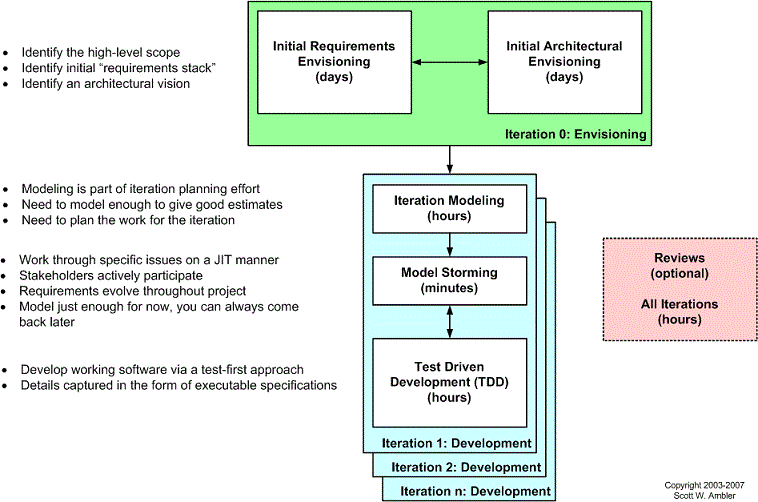

# Agile Model Driven Development (AMDD): The Key to Scaling Agile Software Development

(original article: http://www.agilemodeling.com/essays/amdd.htm)

## 1. Overview

As the name implies, AMDD is the agile version of Model Driven Development (MDD). MDD is an approach to software development where extensive models are created before source code is written. A primary example of MDD is the Object Management Group (OMG)'s Model Driven Architecture (MDA) standard. With MDD a serial approach to development is often taken, MDD is quite popular with traditionalists, although as the RUP/EUP shows it is possible to take an iterative approach with MDD. The difference with AMDD is that instead of creating extensive models before writing source code you instead create agile models which are just barely good enough that drive your overall development efforts. AMDD is a critical strategy for scaling agile software development beyond the small, co-located team approach that we saw during the first stage of agile adoption.

Figure 1 depicts a high-level lifecycle for AMDD for the release of a system. First, let's start with how to read the diagram. Each box represents a development activity. The envisioning includes two main sub-activities, initial requirements envisioning and initial architecture envisioning. These are done during Inception, iteration being another term for cycle or sprint. "Iteration 0, or Inception", is a common term for the first iteration before you start into development iterations, which are iterations one and beyond (for that release). The other activities - iteration modeling, model storming, reviews, and implementation - potentially occur during any iteration, including Inception. The time indicated in each box represents the length of an average session: perhaps you'll model for a few minutes then code for several hours. I'll discuss timing issues in more detail below.

Figure 1. The AMDD lifecycle: Modeling activities throughout the lifecycle of a project.

Figure 2 depicts how the AMDD activities fit into the various iterations of the agile software development lifecycle. It's simply another way to show that an agile project begins with some initial modeling and that modeling still occurs in each construction iteration.

Figure 2. AMDD Through the Agile Development Lifecycle.

## 2. Envisioning

The envisioning effort is typically performed during the first week of a project, the goal of which is to identify the scope of your system and a likely architecture for addressing it. To do this you will do both high-level requirements modeling and high-level architecture modeling. The goal isn't to write detailed specifications, that proves incredibly risky in practice, but instead to explore the requirements and come to an overall strategy for your project. For short projects (perhaps several weeks in length) you may do this work in the first few hours and for long projects (perhaps on the order of twelve or more months) you may decide to invest two weeks in this effort. I highly suggest not investing any more time than this as you run the danger of over modeling and of modeling something that contains too many problems (two weeks without the concrete feedback that implementation provides is a long time to go at risk, in my opinion).

> Through initial, high-level modeling you can gain the knowledge that you need to guide the project but choose to wait to act on it.

## 2.1 Initial Requirements Modeling

For the first release of a system you need to take several days to identify some high-level requirements as well as the scope of the release (what you think the system should do). The goal is to get a good gut feel what the project is all about. For your initial requirements model my experience is that you need some form of usage model to explore how users will work with your system, an initial domain model which identifies fundamental business entity types and the relationships between then, and an initial user interface model which explores UI and usability issues.

I cannot say this enough: your goal is to build a shared understanding, it isn't to write detailed documentation. A critical success factor is to use inclusive modeling techniques which enable active stakeholder participation.

## 2.2 Initial Architecture Modeling

The goal of the initial architecture modeling effort is to try to identify an architecture that has a good chance of working. This enables you to set a (hopefully) viable technical direction for your project and to provide sufficient information to organize your team around your architecture (something that is particularly important at scale with large or distributed teams).

On the architecture side of things I'll often create free-form diagrams which explore the technical infrastructure, initial domain models to explore the major business entities and their relationships, and optionally change cases to explore potential architecture-level requirements which your system may need to support one day. In later iterations both your initial requirements and your initial architect models will need to evolve as you learn more, but for now the goal is to get something that is just barely good enough so that your team can get going. In subsequent releases you may decide to shorten Inception to several days, several hours, or even remove it completely as your situation dictates. The secret is to keep things simple. You don't need to model a lot of detail, you simply need to model enough. If you're writing use cases this may mean that point-form notes are good enough. If you're domain modeling a whiteboard sketch or collection of CRC cards is likely good enough. For your architecture a whiteboard sketch overviewing how the system will be built end-to-end is good enough.

Many traditional developers will struggle with an agile approach to initial modeling because for years they've been told they need to define comprehensive models early in a project. Agile software development isn't serial, it's iterative and incremental (evolutionary). With an evolutionary approach detailed modeling is done just in time (JIT) during development iterations in model storming sessions.

## 3. Iteration Modeling: Thinking Through What You'll Do This Iteration

At the beginning of each Construction iteration the team must plan the work that they will do that iteration. An often neglected aspect of Mike Cohn's planning poker is the required modeling activities implied by the technique. Agile teams implement requirements in priority order, see Figure 3, pulling an iteration's worth of work off the top of the stack. To do this successfully you must be able to accurately estimate the work required for each requirement, then based on your previous iteration's velocity (a measure of how much work you accomplished) you pick that much work off the stack. For example, if last iteration you accomplished 15 points worth of work then the assumption is that all things being equal you'll be able to accomplish that much work this iteration. This activity is often referred to as the "planning game" or simply iteration planning.	Agile Modeling

Figure 3. Agile requirements change management process.

To estimate each requirement accurately you must understand the work required to implement it, and this is where modeling comes in. You discuss how you're going to implement each requirement, modeling where appropriate to explore or communicate ideas. This modeling in effect is the analysis and design of the requirements being implemented that iteration.

With initial iteration modeling you explore what you need to build so that you can estimate and plan the work for the iteration effectively.

## 4. Model Storming: Just In Time (JIT) Modeling

My experience is that the vast majority of modeling sessions involve a few people, usually just two or three, who discuss an issue while sketching on paper or a whiteboard. These "model storming sessions" are typically impromptu events, one project team member will ask another to model with them, typically lasting for five to ten minutes (it's rare to model storm for more than thirty minutes). The people get together, gather around a shared modeling tool (e.g. the whiteboard), explore the issue until they're satisfied that they understand it, then they continue on (often coding). Model storming is just in time (JIT) modeling: you identify an issue which you need to resolve, you quickly grab a few team mates who can help you, the group explores the issue, and then everyone continues on as before. Extreme programmers (XPers) would call modeling storming sessions stand-up design sessions or customer Q&A sessions.

## 5. Executable Specification via Test Driven Development (TDD)

During development it is quite common to model storm for several minutes and then code, following common Agile practices such as Test-First Design (TFD) and refactoring, for several hours and even several days at a time to implement what you've just modeled. For the sake of discussion test-driven design (TDD) is the combination of TFD and refactoring. This is where your team will spend the majority of its time, something that Figure 1 unfortunately doesn't communicate well. Agile teams do the majority of their detailed modeling in the form of executable specifications, often customer tests or development tests. Why does this work? Because your model storming efforts enable you to think through larger, cross-entity issues whereas with TDD you think through very focused issues typically pertinent to a single entity at a time. With refactoring you evolve your design via small steps to ensure that your work remains of high quality.

TDD promotes confirmatory testing of your application code and detailed specification of that code. Customer tests, also called agile acceptance tests, can be thought of as a form of detailed requirements and developer tests as detailed design. Having tests do "double duty" like this is a perfect example of single sourcing information, a practice which enables developers to travel light and reduce overall documentation. However, detailed specification is only part of the overall picture - high-level specification is also critical to your success, when it's done effectively. This is why we need to go beyond TDD to consider AMDD.

You may even want to "visually program" using a sophisticated modeling tool. This approach requires a greater modeling skillset than is typically found in most developers, although when you do have teams made up with people of these skills you find that you can be incredibly productive with the right modeling tools.

## 6. Reviews

You may optionally choose to hold model reviews and even code inspections, but as I write in Model Reviews: Best Practices or Process Smells? these quality assurance (QA) techniques really do seem to be obsolete with agile software development, at least in the small. On larger teams, or in very complex situations, reviews can add value because when they're done right they provide excellent feedback into your IT governance efforts.

## 7. How is AMDD Different?

From a design point of view the AMDD approach of Figure 1 is very different than traditional development approaches where you create a design model first then code from it. With AMDD you do a little bit of modeling and then a lot of coding, iterating back when you need to. Your design efforts are now spread out between your modeling and coding activities, with the majority of design being done as part of your implementation efforts - in many ways this was also true for many traditional projects, the developers would often do significantly different things than what was in the design models, but the designers would often blame the developers instead of question their overly serial processes.

AMDD is different from techniques such as Feature Driven Development (FDD) or the use case driven development (UCDD) styles of EUP and Agile Unified Process (AUP) in that it doesn't specify the type of model(s) to create. All AMDD suggests is that you apply the right artifact but it doesn't insist on what that artifact is. For example FDD insists that features are your primary requirements artifact whereas UCDD insists that use cases are. AMDD works well with both an FDD or a UCDD approach because the messages are similar - all three approaches are saying that it's a good idea to model before you code.

An interesting implication of Figure 1 is that it doesn't make sense to have people who are just modeling specialists on your development team any more. What are they going to do, model for a few minutes and then sit around for hour or days until they're needed again? What is really needed is something I call a generalizing specialist, someone with one or more specialties as well as general skills in the entire lifecycle, who can both code and when they need to model as well.

## 8. Why Does This Work?

AMDD works for several reasons:

1. You can still meet your "project planning needs". By identifying the high-level requirements early, and by identifying a potential architecture early, you have enough information to produce an initial cost estimate and schedule.
1. You manage technical risk. Your initial architecture modeling efforts enable you to identify the major areas of technical risk early in the project without taking on the risk of over modeling your system. It's a practical "middle of the road" approach to architectural modeling.
1. You minimize wastage. A JIT approach to modeling enables you to focus on just the aspects of the system that you're actually going to build. With a serial approach, you often model aspects of the system which nobody actually wants.
1. You ask better questions. The longer you wait to model storm a requirement, the more knowledge you'll have regarding the domain and therefore you'll be able to ask more intelligent questions.
1. Stakeholders give better answers. Similarly, your stakeholders will have a better understanding of the system that you're building because you'll have delivered working software on a regular basis and thereby provided them with concrete feedback.

## 9. Approaches to AMDD

There are three basic approaches to applying AMDD on a project:

1. Manual. Simple tools, such as whiteboards and paper, and inclusive models are used for modeling. This is likely 70-80% of all business application modeling efforts.
1. Design Tool. Inclusive models are used to explore requirements with stakeholders, and to analyze those requirements. Developers then use sophisticated modeling tool for detailed design, (re)generating source code from the models. This is likely 20-30% of all business application modeling efforts.
1. Agile MDA. Very sophisticated, MDA-based modeling tools used to create extensive models from which working software is generated. At best this approach will be used for 5-10% of business application modeling efforts.

