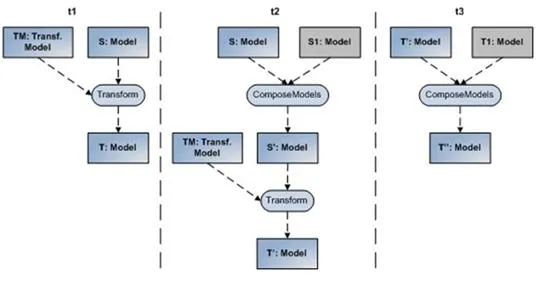
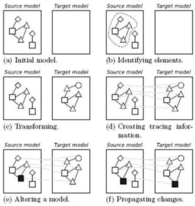
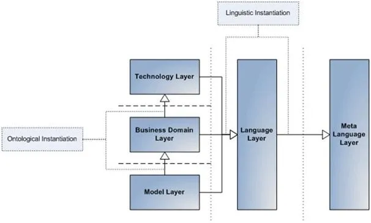
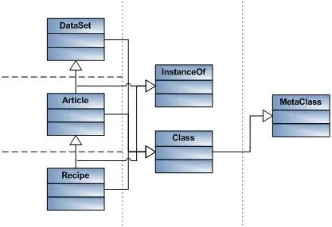

# 8 Reasons Why Model-Driven Approaches (will) Fail

(original article: https://www.infoq.com/articles/8-reasons-why-MDE-fails/)

Model-driven software development is gaining more and more interest nowadays. Acronyms starting with MD are invented from day to day. To mention a couple of them: MDA, MDE, MDD, MDSD, MDSE. We can solve this Babel-like confusion in a creative way, but I prefer the term Model-Driven Engineering (MDE). MDE was first mentioned by Kent   and is wider in scope than MDA. Although the MDA acknowledge things like a richer modelling space than just the dichotomy between PIM and PSM and the automation of transformations between models, they stay far from defining a real engineering approach. MDE adds the notion of multiple modelling dimensions and a software engineering process to MDA.

However, MDA and MDE still are high level visions, they aren’t worked out in detail. If you want to start building software in a model-driven way you’ll need to devise some methodology based on ideas and practical experiences from others. In this article I want to state eight reasons why model-driven approaches fail or will fail to make their promises come true. Or, formulated in a positive way: eight points to pay attention to when starting with MDE.

## 1. Not targeting all goals of Model-Driven Engineering

The underlying motivation for Model-Driven Engineering is to improve productivity. In the current complex enterprise landscapes, with a growing diversity of systems and platforms, newly build software applications can’t be compatible with all existing and future systems. MDE aims to increase the return a company derives from its software development effort. This benefit is delivered in two basic ways   :

1. By improving the short-term productivity of developers. That is, by increasing the value of primary software artifacts in terms of how much functionality they deliver.
1. By improving the long-term productivity of developers. That is, by reducing the rate at which primary software artifacts become obsolete.

The primary focus of most tool vendors is to deliver the first benefit. New software artifacts can be generated  from (mostly technical) models, thereby supporting developers in their productivity. However, after the initial building process no support is delivered in managing the lifecycle of the software artifact. Changes have to be made in the generated source code or in parts of the model, this will lead to round-trip problems.

In the current fast changing enterprise landscapes the second benefit will become more and more important. The longer a software artifact remains of value, the greater the return derived from the initial effort to create the artifact. Hence an important aspect of MDE is reducing the sensitivity of primary artifacts to change. Atkinson and Kühne   indicate four main fundamental forms of change which are of particular importance:

1. Personnel; vital development knowledge  shouldn’t be only stored in the minds of developers, such information will be lost in the all too frequent event of personnel fluctuations. Therefore this information should be made easy accessible for others than the initial creators of the software artifact. If possible it should take a form which is understandable by all interested stakeholders including customers. Technical implication: primary software artifacts can be expressed using a concise and tailorable presentation.
1. Requirements; changing requirements is a known problem in software engineering. However, nowadays this problem is bigger than ever. In the current fast changing business environment of enterprises new functionality have to be developed faster than ever. In the mean time all these changes must have a low impact on existing systems in terms of maintenance and disrupting online-systems. In the most ideal situation changes have to be made while the systems keep running. Technical implication: the need to support the dynamic addition of new types at runtime.
1. Development platforms; development platforms are also in a state of constant evolution. To decouple the lifetime of a software artifact from the development tool used for its initial creation it is necessary to decouple the artifact or the model representing the artifact from the development tool. Technical implication: tools should store artifacts in formats that can be used by other tools, in other words, they should support high-levels of interoperability.
1. Deployment platforms; the last form of change is the evolution in deployment platforms. New platforms, middleware solutions, application servers, etc. are released faster and faster. To increase the lifetime of software artifacts it is necessary to protect them against changes in the deployment platform. This form of change is the main driver behind the MDA approach presented by the OMG  . Technical implication: it is necessary to automate (to the greatest extent possible) the process of obtaining platform specific software artifacts from platform independent ones through the application of user definable mappings.

In most cases when people are talking about MDA or MDE the only goal associated with these terms is to reduce the software artifacts’ sensitivity for change in deployment platforms by using a PIM and a PSM. The other mentioned goals, however, are of the same importance and a methodology fulfilling all these needs can solve a lot of problems in software development processes and business-IT alignment.

In the context of business-IT alignment, James Taylor has added some remarks on the mentioned goals of MDE. He states that a focus on developers and their productivity is not enough to get us to MDE because the model that should drive the engineering is a business model, not a technical one. He adds the following two goals:

- Improve the ability of non-technical users to safely and effectively make changes to their software to reflect their changing needs and understanding of their business.
- Increase the ability of the software to take action by effectively leveraging data gathered in the past to make useful predictions about the future.

He gives an example of a business rules management system enabling these goals. I agree with him on the fact that an MDE methodology should strive to reach these goals. However, in the current practice (and I think that won’t change) you always need a combination of a business expert and a technical (or formal) specialist for the definition of the models or rules due to the formal aspect of the modelling languages. Besides that, business users model from a user perspective instead of a systems perspective (see for example the gap between BPMN and BPEL). So, in most cases you want to have a developer translating this perspectives into each other. An exception is the part of a system concerning the business rules. If they are formulated in an understandable language and sufficient tooling is available it should be possible for non-technical users to update the rule definitions.

## 2. Only using one modeling dimension: the dichotomy between PIM and PSM

An approach fulfilling the goal of MDE has to have more than the only modeling dimension presented in the Model-Driven Architecture of the OMG. They present the platform specific/platform independent dimension which, in principle, is an example of the more general abstract/concrete dimension. In this dimension we can only talk about whether a model is abstract (or platform independent) with respect to some other model. It depends on the viewpoint whether a model is platform independent or platform specific (abstract or concrete), but whenever a model is platform specific it must include all details needed for implementation.

Kent  defines two additional categories of dimensions needed for MDE. The first category contains various dimensions of concern. The first dimension of concern comes from the distinction of models on the base of the subject area they belong to. Different users of the system may have different viewpoints on the system focusing on a subset of the system features. By example the part of the system dealing with customers, or the part of the system concerned with processing of orders. The second dimension of concern enumerates aspects of a system. Examples of aspects are information /data, presentation, concurrency control, security, distribution and error handling.

The second category of dimensions is less concerned with the technical aspects of a system, but more with organizational issues. The dimensions in this category include authorship, version (as in version and configuration control), location (in case the system development is distributed across sites) and stakeholder (such as business expert or programmer)  .

In software development projects it is necessary to determine the important dimensions for a particular project. In most projects authorship and versioning will be important, but other dimensions need the identification of points of interest, like which subject areas play a role and which system aspects are of importance. Another important decision is the levels of abstraction to be used in the process and which stakeholders are involved (for which understandable models have to be made). When building models in a software development process, each model can be placed at an intersection of the dimensions. The various dimensions at an intersection play an important role in the choice for a modeling language for that particular model. By example, the modelling language is influenced by the subject area, the stakeholders and the level of abstraction. In this case we can design a Domain Specific Language (DSL) tailored to the specific subject area, the specific stakeholder and with the right level of abstraction.

So, an MDE approach should define multiple DSL’s, together describing an enterprise application. Defining models using these DSL’s will result in multiple, connected models defined in different languages, which should be combined and made executable using a transformation process. At Mendix we use, by example, the subject dimensions of concern for dividing a solution into different modules (CRM, HRM, Order entry, Customer portal, etc.). Each module is divided into different models along the aspect dimension of concern. We use the following DSL’s to describe these models:

- Business Object DSL
- Rich Internet Forms DSL
- Microflow DSL
- Business Rules DSL
- Services DSL
- Security DSL

If you wonder what kind of flow a Microflow is, see Architecture requirements for Service-Oriented Business Applications, this article describes the programming model needed for SOBA’s including the different flows needed to implement the services.

Depending on the number of models, the transformation process describing the order in which models are created, composed and transformed, can become very complex. Various scenarios exist, which can be combined to form an engineering process.

## 3. Focusing on generating new artifacts

In reason 1 we’ve already seen that change is an important (and often ignored) aspect of MDE. Software systems usually change during their life time. We call this the evolution of a software system. In literature it is also called maintenance and comes with three different reasons :

- Corrective maintenance indicates the changes made in a system to solve processing, performance or implementation failures.
- Adaptive maintenance is the change of a software system triggered by changes in the business or technical environment.
- Perfective maintenance is used to improve the quality (processing inefficiency, performance enhancement, etc.) and maintainability of a system.

In principle three scenarios of evolution exist: additive evolution, replacement of a system component and subtractive evolution . These scenarios describe the lifetime of a system component, once it is added it can change during its lifetime till it is removed.

In the additive evolution scenario a new system component is added to an existing software system.  Figure 1 shows a possible scenario when using Model-Driven Engineering. At moment t1 the initial system is shown. Moment t2 shows an addition of a source model S1 which is composed into one source model S’ with S before it is transformed to a new target model T’. Moment t3 shows an addition of a target model T1 to the existing system T’ resulting in a new system T’’.

Figure 1 Implementation of additive changes in the transformation pattern by adding new models: moment t1 shows the initial state, moment t2 shows an addition of a source model S1, moment t3 shows an addition of a target model T1  .

In  Figure 1 only addition by composition is visualized. It is of course possible to define much more scenarios based on the addition of source, target or transformation models using composition or transformation.

Corrective or perfective maintenance mostly leads to replacements of system components by a changed version of that component. Changes in a component can be made by the adaption of the source model, but also by changing the transformation definition or by directly changing the target model. Changing a component by changing the source model can ask for so-called change propagating transformations in contrast to stateless transformations which only support rerunning a transformation from scratch after the initial run. Change propagating transformations support the non-destructive propagation of changes from the source model to the already existing target model  . Using a change propagating transformation enables the replacement of a component at runtime or with preservation of runtime data. An example of such a transformation is updating the structure of a database (the target model) based on an object model (the source model) without losing data. This, of course, isn’t possible for every change.

Change propagating languages can also be used to keep different models in sync with each other. As we stated before a software artifact has to be modelled with different models. These models, or DSL’s, use elements of each other through well-defined interfaces (e.g. a microflow uses elements from the business object model). If one of the models changes (elements are changed or deleted) these changes should be propagated to the referring models. Alanen and Porres   describe some of the categories of changes that can be propagated.

Figure 2 Change propagation illustrated  

To illustrate the problem domain a bit more let’s take a look at the example in  Figure 2. The following parts of a change propagating model transformation are visualized:

1. An initial model is made.
1. The model is searched to identify the appropriate elements to transform.
1. The source model is transformed into a target model.
1. Tracing information is recorded to identify which elements in a target model are related by the transformation to elements in the source model.
1. The source model is altered.
1. Updates in source model elements involved in the transformation are detected and the relevant operations are executed to change (non-destructively) the corresponding elements in the target model.

Although this simple example shows the basic idea of change propagating transformations it doesn’t include a number of the decisions and challenges that any particular approach should consider. The most important ones are listed below :

- Checking or updating propagation. The approach should at a minimum tell the user where changes need to be made to the target model to make it conformant. At the other extreme an approach may forcibly update the target model without informing the user of which changes will be made.
- Manual or automatic change propagation. An approach can need changes to be manually applied to the target model or it can propagate arbitrary changes without manual help.
- Batch or immediate propagation. Batch change propagation takes a number of changes from the source model and propagates them to the target model only when explicitly requested by the user. Immediate change propagation changes the target model as soon as a change has been made in the source model.
- Relating source and target model elements. Every change propagating approach requires a mechanism that relates source and target elements created by a certain rule.
- Detecting elements for removal. Removing source model elements should lead to the relevant elements in the target model also being removed (provided such removals preserve the property of non-destructivity of manual changes).
- Checking correctness of propagation and conflict resolution. Some changes in the source model can lead to conflicts with manual changes in the target model. The way this conflicts are handled may differ for an approach.

At Mendix we use change propagating transformations in two different ways. The first case is updating the structure of a database (the target model) based on the Business Object DSL (the source model) without losing data. We use traces to relate source and target elements for tracking changes. We also record the creation and removal of elements in the Business Object DSL so that we can update the database structure also for these changes.

In the second case we use change propagating transformations to keep the different models in sync. The Mendix Business Modeler automatically synchronizes the models when elements are changed. Even changes which affect elements or references of other DSL’s are automatically propagated. If a change can’t be propagated due to manual changes the modeling environment will report consistency errors, guiding the user directly to the places were manual changes have to be made.

In general we can say: if MDE solutions don’t pay attention to change propagation, which is a complex problem as shown above, they don’t fulfill all the goals of Model-Driven Engineering.

## 4. Using general purpose languages

Lot of the current existing initiatives in the field of MDE are using GPL’s like UML. This, however, has the disadvantage that users of the (modeling) language have to learn all the concepts available in that GPL. In that way we can’t fulfill the goal of MDE to make a software artifact less sensitive for changes in personnel (see reason 1). I think we should make use of DSL’s in MDE for the following reasons:

- The (modeling) language can be fully tailored to the goal it has to be used for.
- Users work with concepts they know. DSL’s can be vertical (tailored to a certain business domain) or horizontal (tailored to a technical discipline).
- Users only get what they need, they only have to learn the limited set of concepts related to the domain they are working on.
- Tools can be tailored to the use of specific DSL’s even more supporting the user in defining the models in an easy way.

The challenge for a software development project using DSL’s is to ensure that the right DSL is used by the right person for the right situation.

## 5. Using custom defined domain specific languages

Although the use of DSL’s has advantages, just creating DSL’s based on the flavor of the day will result in a proliferation of DSL’s. I think the proliferation of DSL’s can’t be fully avoided, but it can be made less painful by defining DSL’s as specific instantiations of GPL’s by using meta models. Although they are not real meta models, the use of stereotypes in UML is a good example of a technique for defining a model language for a specific purpose based on a GPL.

The concept of meta modeling is mostly used as a means of language definition. Atkinson and Kühne call this linguistic meta modeling . But according to Atkinson and Kühne this “traditional” point of view on meta modeling covers only one of the two important dimensions. Besides linguistic instantiation, like student is an instance of entity, an ontological instantiation relation exists defining that student is also an instance of person  . In linguistic meta modeling student and person are on the same layer, whereas from an ontological point of view person would be on a meta layer. Atkinson and Kühne call this ontological meta modeling.

Both linguistic and ontological meta modeling are needed for defining DSL’s based on GPL’s. They should  be combined into a meta modeling hierarchy, defining the meta models for the actual model layer.

Figure 3 Possible meta model hierarchy

Figure 3 shows an example of a meta model hierarchy, possible elements in such a hierarchy are shown in  Figure 4.

Figure 4 Example elements of a meta model hierarchy

For a full explanation of the use of linguistic and ontological meta models, including an example definition of a domain specific process modeling language, see Combining GPL’s and DSL’s for MDE.

To conclude: I think it isn’t possible to fully avoid a proliferation of DSL’s, but by defining them based on GPL’s they are interoperable with each other and can even be made executable in the same way.

## 6. Using model transformations which are not fully executable

It’s nice to develop software in a model-driven way, but we’re doing that since the beginning of software development by creating fancy designs. The essential change is that models are no longer used only as mere documentation for programmers, but can now directly be used to drive software development. The additional value of MDE should come from the automatic transformation of high level models into lower-level (implementation) models.

Following Sendall & Kozaczynski   it is recommendable for a model transformation language which supports model-driven software development to:

1. Be executable;
1. Be implementable in an efficient way;
1. Be fully expressive, yet unambiguous, for transformations that modify existing models as well as create completely new models;
1. Facilitate developer productivity with precise, concise and clear descriptions:
    1. The language should clearly differentiate the description of the source model selection rules from the rules for producing the target model;
    1. The language should offer graphical constructs in the cases that the concepts represented are more concise and intuitive in graphical form compared to a textual one;
    1. The language should be declarative by making implicit any concepts or mechanisms that can be intuitively interpreted from the context;
1. Provide a means to combine transformations to form composite ones, offering at least operators for sequencing, conditional selection and repetition of transformations; and
1. Provide a means to define the conditions under which the transformation is allowed to execute.

Formulating it in one sentence we can say that it is very important that a model transformation is executable and easy to define.

## 7. Not testing the model

One of the biggest pitfalls of MDE approaches is the cumbersome support for testing and debugging the software artifact on the model level. That, while MDE lends itself to quality engineering because:

- Models are primary software artifacts, so the quality of models dictates the quality of the artifacts generated from that model.
- Tools can analyze and monitor models for various characteristics, e.g. consistency checking, model checking/simulation, etc.
- Models can be used as input for model-based testing. Model-based testing involves test generation, execution and evaluation using models.

However, you have to pay special attention to the quality of the models. The two main quality criteria for models to be used in MDE are transformability and maintainability  . Solheim and Neple decompose these criteria in several other criteria. The quality criteria for transformability are shown in  Table 1, while the maintainability criteria are shown in Table 2.

| Quality criterion | Type of quality | Explanation |
| - | - | - |
| Completeness | Semantic | The model contains all statements that are correct and relevant about the domain. This can be checked against the ontological meta model. |
| Well-formedness | Syntactic | The model complies with its language definition. This can be checked using the linguistic meta model. |
| Precision | Technical pragmatic | The model is sufficiently accurate and detailed for a particular automatic transformation. |
| Relevance | Technical pragmatic | The model contains only the statements necessary for a particular transformation |

Table  1 Transformability quality criteria for models

| Quality criterion | Type of quality | Explanation |
| - | - | - |
| Traceability | Technical pragmatic | The model’s elements can be traced backward to their origin (requirements), and forward to their result (another model or program code). |
| Well-designedness | Syntactic | The model has a tidy design, making it understandable by humans and transformable to an understandable and tidy result. |

Table 2 Maintainability quality criteria for models

As described in  Table 1 part of the quality can be ensured by checking the model against its meta models. Besides that you can use model validation, model checking and model-based testing as techniques for ensuring the quality of the models and the resulting software artifact.

## 8. Insufficient tooling

The last reason why MDE approaches (will) fail is the insufficient support of tooling. Tooling is essential to maximize the benefits of having models, and to minimize the effort required to maintain them  . Current programming languages are all supported by an integrated development environment (IDE) making the writing and maintenance of code less painful. An MDE methodology without supporting development tooling won’t deliver us the benefits we need.

The development environment for defining the models should be fully tailored to the used domain-specific languages. The tooling should include:

- Tools to check/enforce well-formedness constraints on models. That is, type/static semantics checking.
- Support for working with instances of models. These include checking the validity of instances against a model, generation of instances from a model, both with and without user interference, and (partial) generation of models from instances.
- Tools to support mappings between models. Both the generation of a source model from a target model and the synchronization of changes between models need to be supported by appropriate tooling.
- Concepts for the dynamic extension of the language and its code generation modules.

Besides these elements the tooling should support multiple DSL’s, together describing the whole system. These DSL’s are connected and should have the possibility to use elements from each other. Other features developers are used to, like auto-completion, syntax coloring and refactoring options (renaming, moving elements, etc.) are also necessary elements for software engineering tools.

As stated in reason 7, testing is an important aspect of an MDE methodology. An MDE tool should at least support this by providing compiler-like behavior with error messages. These error message should identify problems in the models and not only within the generated source code.

A recent survey, “Users’ Choice IDEs – 2008”, among more than 1,200 developers concluded that the debugger is the most important attribute of an IDE. At its most basic function, the debugger runs with the applications and stops on the problem line when the program crashes, thus making it easy for the developer to identify and fix the problem. In case of MDE, the debugger should identify the model element causing the problem. The debugger should also support to single step through each model element/activity, set breakpoints in the models, set conditional breakpoints and other capabilities.

Tools should also manage the software development process. For example directing developers in the models they should produce and when. Tools can provide wizards guiding the high level steps to take according to the methodology, but also wizards guiding the definition of specific elements of a language. Hence an MDE methodology with a supporting tool which directs users as much as possible according to this methodology is easy to learn and use.

Last but not least, the tooling for an MDE approach should support teamwork for the development of big software projects. So, version control and support for distributed working are important.

## Conclusion

We’ve seen eight reasons why model-driven approaches can fail to make their promises come true. It’s not my goal to discourage you from starting with model-driven software development. I just wanted to show you the complexity of it and wanted to share some thoughts hopefully pointing you at directions helping you to overcome the complexity of MDE. Although not every point can be worked out into detail in the scope of one article, I hope the points are clear enough to understand the essence.
