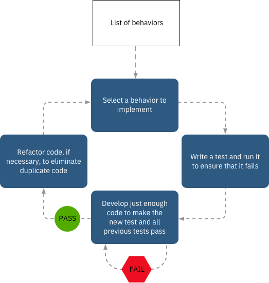

# Test-driven development

(original article: https://www.ibm.com/garage/method/practices/code/practice_test_driven_development/)

Test-driven development (TDD) is about innovating faster and reducing waste. It starts with writing a failing test case and then creating just enough code to pass the test.

Test-driven development (TDD), which is rooted in extreme programming, is all about satisfying your team that the code works as expected for a behavior or use case. Instead of aiming for the optimum solution in the first pass, the code and tests are iteratively built together one use case at a time. Development teams use TDD as part of many coding disciplines to ensure test coverage, improve code quality, set the groundwork for their delivery pipeline, and support continuous delivery.

## What is TDD?

The basic concept of TDD is that all production code is written in response to a test case. Robert C. Martin, who is known as Uncle Bob, describes these Three Laws of TDD:

- You are not allowed to write any production code unless it is to make a failing unit test pass.
- You are not allowed to write any more of a unit test than is sufficient to fail; and compilation failures are failures.
- You are not allowed to write any more production code than is sufficient to pass the one failing unit test.

Javier Saldana expresses TDD in this two-rule version:

- Write only enough of a unit test to fail.
- Write only enough production code to make the failing unit test pass.

## Why use TDD?

TDD provides several benefits:

- It can enable faster innovation and continuous delivery because the code is robust.
- It makes your code flexible and extensible. The code can be refactored or moved with minimal risk of breaking code.
- The tests themselves were tested. A key characteristic of a test is that it can fail, and the development team verifies that each new test fails.
- The code that is produced is, by design, easy to test.
- The requirements are implemented with little to no wasted effort because only the function that is needed is written.

## Red/Green/Refactor cycle

A TDD cycle incorporates Uncle Bob's three TDD rules and adds a refactoring step after the tests pass:

TDD practitioners refer to this cycle as the Red/Green/Refactor cycle. In the article TDD - What it is and what it is not, Andrea Koutifaris describes this cycle:

- Red phase: You write an automated test for a behavior that you're about to implement. Based on the user requirement, you decide how you can write a test that uses a piece of code as if it were implemented. This is a good opportunity to think about the externals of the code, without getting distracted by actually filling in the implementation. Think about what the interface should look like? What behaviours should a caller of that interface expect? Is the interface clean and consumable?
- Green phase: You write production code, but only enough production code to pass the test. You don't write algorithms, and you don't think about performance. You can duplicate code and even violate best practices. By addressing the simplest tasks, your code is less prone to errors and you avoid winding up with a mix of code: some tested (your minimalist functions) and some untested (other parts that are needed later).
- Refactor phase: You change the code so that it becomes better. At a minimum, you remove code duplication. Removing duplication generally leads to abstraction. Your specific code become more general. The unit tests provide a safety net which supports the refactoring, because they make sure that the behavior stays the same and nothing breaks. In general, tests should not need to be changed during the refactor stage.

## Unit testing as part of TDD

If your team is hesitant to skip traditional unit tests, remember: TDD drives the code development, and every line of code has an associated test case, so unit testing is integrated into the practice. Unit testing is repeatedly done on the code until each unit functions per the requirements, eliminating the need for you to write more unit test cases.

At IBM, teams found that the built-in unit testing produces better code. One team recently worked on a project where a small portion of the team used TDD while the rest wrote unit tests after the code. When the code was complete, the developers that wrote unit tests were surprised to see that the TDD coders were done and had more solid code.

Unlike unit testing that focuses only on testing the functions, classes, and procedures, TDD drives the complete development of the application. Therefore, you can also write functional and acceptance tests first.

To gain the full benefits of unit testing and TDD, automate the tests by using automated unit test tools. Automating your tests is essential for continuous integration and is the first step in creating an automated continuous delivery pipeline.

## Getting started

You can get started with TDD by following these steps:

1. Think about the behaviors that your implementation requires. Select a behavior to implement.
1. Write a test that validates the behavior. The test case must fail.
1. Add only enough code to make the new test case and all previous test cases pass.
1. Refactor the code to eliminate duplicate code, if necessary.
1. Select the next requirement and repeat steps 1 - 4.

## Key practices for TDD

As teams implemented TDD over time, several key practices emerged:

1. Obtain buy-in for TDD from project leadership.
1. Ensure that the development team understands TDD. Writing the test can sometimes require more effort than writing the code.
1. Run all tests that are developed as part of your development pipeline. A failing test must stop the pipeline.
1. Measure and monitor the value that is gained by implementing TDD.

