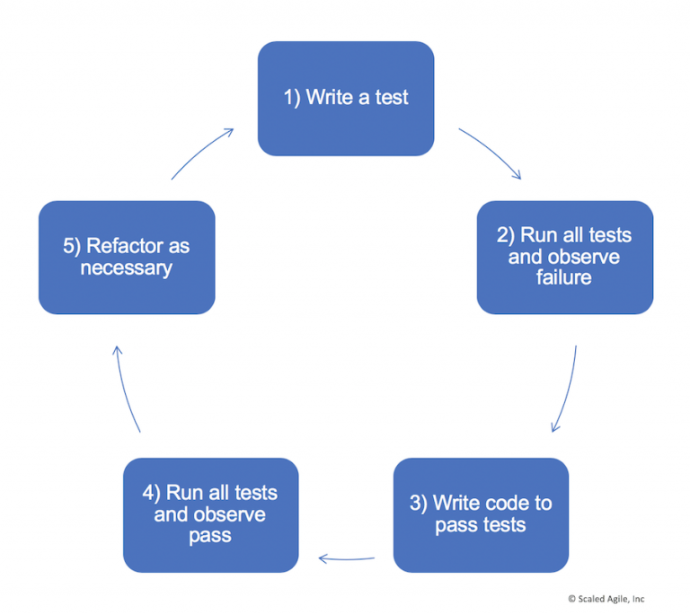

# Test Driven Development

(original article: https://www.scaledagileframework.com/test-driven-development/)

Test-Driven Development (TDD) is a philosophy and practice that recommends building and executing tests before implementing the code or a component of a system. By validating them against a series of agreed-to tests, TDD—an Agile Testing practice—improves system outcomes by assuring that the system implementation meets its requirements. TDD, along with Behavior-Driven Development (BDD), is part of the test-first’ approach to Build Quality into development. Writing tests first creates a more balanced testing portfolio with many fast, automated development tests and fewer slow, manual, end-to-end tests. (See the Test-First section of the Team and Technical Agility article for more detail on the testing pyramid and a balanced testing portfolio.)

Details

Beck and others have defined a set of Extreme Programming (XP) practices under the umbrella label of TDD.

- Write the test first, ensuring that the developer understands the required behavior. This could be a new test or a modification of an existing test.
- Run the test and watch it fail. Because there’s no code yet, this may seem pointless, but it accomplishes two useful objectives: it verifies the test works, including any testing harnesses and demonstrates how the system will behave if the code is incorrect.
- Write the minimum amount of code needed to pass the test. If it fails, rework the code or the test until it passes routinely.
- Continue implementing new code until all tests pass. This step provides the developer with the confidence that their changes meet the current requirements and haven’t created an error in another part of the system.
- Refactor as necessary to ensure the design aligns with changing requirements (e.g., emergent design). Developers continually update their designs to ensure that evolving requirements and a growing codebase don’t lead to poor code quality.

In XP, this practice was designed primarily to operate in the context of unit tests, which are developer-written tests (also a form of code) that evaluate the classes and methods used. These are a form of white-box testing, because they test the internals of the system and the various code paths. To help assure high quality, developers work in pairs to create the code and tests, providing multiple perspectives and a built-in peer review. Even when not developed in pairs, the tests provide another set of eyes that review the code.
A rich set of unit tests ensure that refactoring efforts do not introduce new errors, allowing developers to continuously improve their designs. Refactoring builds quality in by allowing designs to emerge over time, supporting the solution’s changing requirements.

## Unit Tests

TDD creates a large set of developer-level tests, which allows Quality Assurance (QA) and test personnel to focus on other testing challenges. Instead of spending time finding and reporting code-level bugs, they can focus on more complex behaviors and interactions between components.
The open source community has built unit testing frameworks to cover most languages, including Java, C, C#, C++, XML, HTTP, Python, and others. There are unit-testing frameworks for most coding environments a developer is likely to encounter. Unit testing frameworks provide a harness for the development and maintenance of unit tests and for automatically executing them against the system.
With TDD, testing and code are written together and, therefore, occur within the same Iteration. As a result, the regression test automation for unit tests is mostly free for the team. Unit testing is a cornerstone of software agility. Investing in comprehensive unit testing improves quality and productivity.

## Component Tests

Teams also use tests to evaluate larger-scale components of the system. Many of these are present in various architectural layers, where they provide services needed by features or other modules. Testing tools and practices for implementing component tests vary. For example, testing frameworks can hold complicated unit tests written in the framework's language (e.g., Java, C, C#, and so on). This allows many teams to use their unit testing frameworks to build component tests. They may not even think of them as separate functions, as it’s merely part of their testing strategy. In other cases, developers may incorporate other testing tools or write entirely customized tests in any language or environment that is productive for them to test broader system behaviors. These tests are automated as well, serving as a primary defense against unanticipated consequences of refactoring and new code.

## Speeding Up Testing with Test Doubles

TDD tests exercise a relatively small part of the system, yet, each test can require significant time and expense to launch and setup. Also, each may require dependent components and enterprise infrastructure that may or may not be available immediately. Test doubles’ are code constructs that accelerate testing by substituting slow, unavailable, or expensive components with faster proxies. TDD practices typically make significant use of test doubles.
